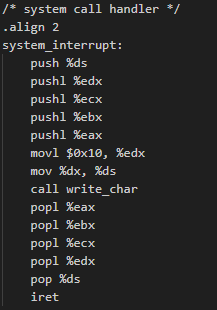
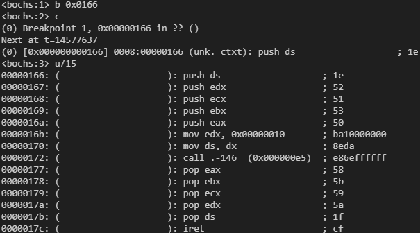
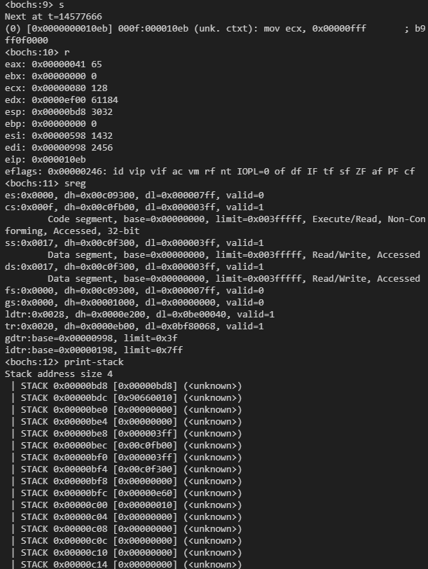
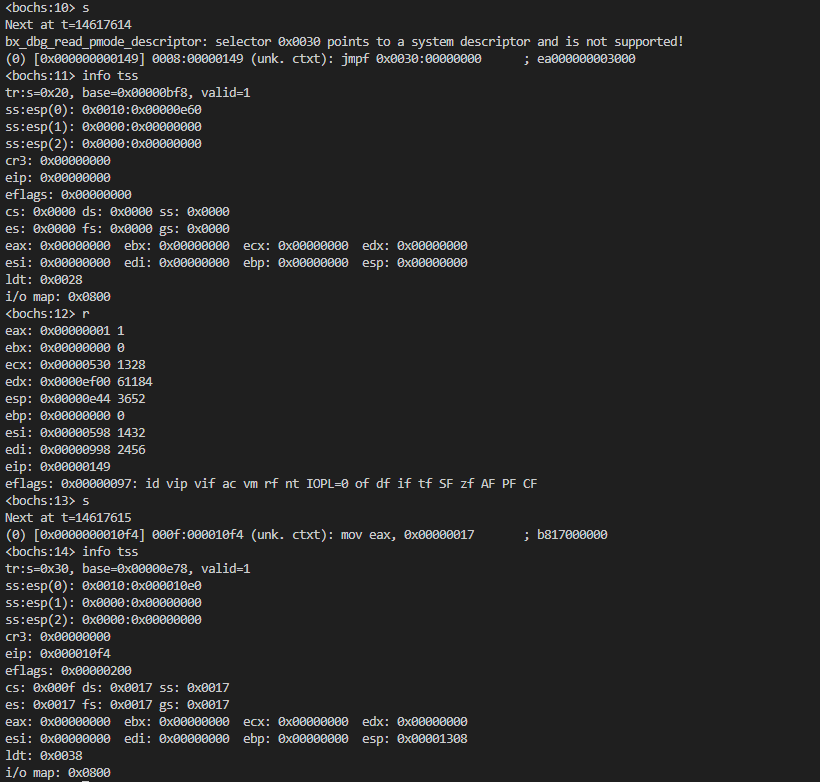
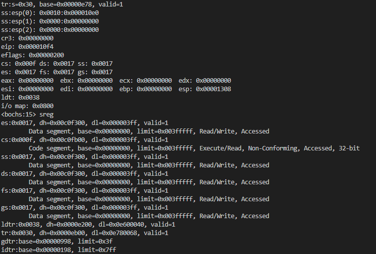
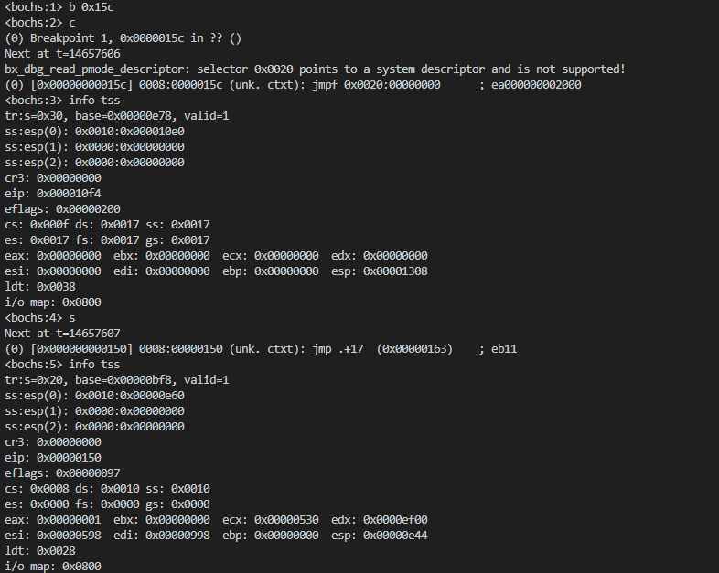
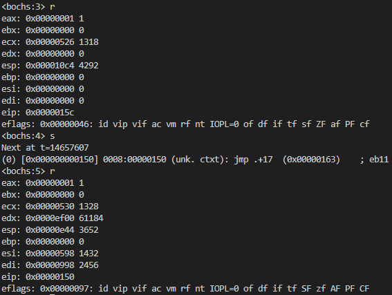

# 实验二 调试分析 Linux 0.00 多任务切换

## 1. 当执行完 `system_interrupt` 函数，执行 `153` 行 `iret` 时，记录栈的变化情况

查看head.s中system_interrupt函数内容如下。



该函数执行地址为`0x0166`，设置断点`b 0x0166`然后反汇编得到`iret`的地址`0x017c`



运行到`iret`前，先记录下当前栈和寄存器的情况，栈顶指针`ESP=0xe4c`,`EIP=0x017c`为下一步`iret`的地址。

代码段寄存器`CS=0x08`（当前执行的代码段以及执行代码的特权级别为 0 内核态）


`s`单步调试运行到`iret`后，再次记录当前栈和寄存器的情况，对比上面的栈可以看出

`EIP`=`0x10eb`为上一步的栈顶

`CS `=`0x0f` （当前执行的代码段以及执行代码的特权级别为 3 用户态）

此时栈已经从内核栈切换到了用户栈，且栈顶指针`0x0bd8`



## 2.  当进入和退出 `system_interrupt` 时，都发生了模式切换，请总结模式切换时，特权级是如何改变的？栈切换吗？如何进行切换的？

#### 特权级的变化

- 用户程序运行时，特权级是 **3（用户模式）**，即使用的是用户态的代码和数据段（例如，LDT 表中定义的）。

- 当执行中断指令时，CPU 会发生模式切换：

  - 从 **用户模式（特权级 3）** 切换到 **内核模式（特权级 0）**，这时 CPU 的特权级（CPL）会从 3 变为 0。
  - 切换的过程中，CPU 会使用 **内核代码段** 和 **内核数据段**，而不是用户段。内核的栈会被使用来执行内核代码。
- 当返回时`iret`的执行过程会使得 特权级 从 0（**内核模式**） 切换回 3（**用户模式**）。并且恢复中断发生前的程序状态，包括用户模式下的栈指针、指令指针以及标志寄存器等。

#### 栈的切换

- 在用户模式下，程序会使用用户栈，而在进入内核模式后，CPU 会使用 **内核栈** 来保存寄存器状态和执行上下文。

- 在 `head.s` 中，当设置 IDT 时，你可以看到以下部分代码：

  ```
  movl $TSS0_SEL, %eax
  ltr %ax
  ```

  这段代码将内核的 **任务状态段（TSS）** 选择符加载到 `tr` 寄存器中，**任务状态段** 管理着内核模式下的栈切换。每当发生中断时，TSS 会自动保存内核模式下的栈指针，并加载合适的栈。

  当 CPU 执行到 `iret` 指令时，它会恢复原来中断发生之前的栈指针和寄存器状态，将原来保存`SS ESP值`加载到寄存器中从而切换回原来的用户栈。
  
## 3. 当时钟中断发生，进入到 `timer_interrupt` 程序，请详细记录从任务 `0` 切换到任务 `1` 的过程。 

时钟中断发生后，操作系统会进行任务切换，这通常涉及从当前任务切换到下一个任务。在你提供的代码中，当发生时钟中断时，`timer_interrupt` 处理程序会被调用，进而执行任务切换。在这个过程中，涉及的关键操作包括更新当前任务的状态、切换任务的堆栈（通过任务状态段 TSS）、以及通过 `ljmp` 指令跳转到下一个任务的执行位置。

### **1) 时钟中断触发**

当时钟中断发生时，CPU 会按照中断向量表（IDT）中的设置跳转到相应的中断处理程序。在你提供的代码中，时钟中断的处理程序是 `timer_interrupt`，它会处理任务切换的逻辑。

以下是时钟中断的处理程序 `timer_interrupt`：

```
timer_interrupt:
    push %ds
    pushl %eax
    movl $0x10, %eax        # 设置数据段为内核段
    mov %ax, %ds            # 更改 ds 寄存器为内核数据段
    movb $0x20, %al         # 向 PIC 发送 EOI (End Of Interrupt)
    outb %al, $0x20
    movl $1, %eax
    cmpl %eax, current      # 检查当前任务是否为任务 0
    je 1f                   # 如果是任务 0，就跳到 1f
    movl %eax, current      # 更新当前任务为任务 1
    ljmp $TSS1_SEL, $0      # 跳转到任务 1 的代码执行处
    jmp 2f
1:
    movl $0, current        # 更新当前任务为任务 0
    ljmp $TSS0_SEL, $0      # 跳转到任务 0 的代码执行处
2:
    popl %eax
    pop %ds
    iret
```

### **2) 任务切换的详细过程**

#### 保存当前任务的状态

在 `timer_interrupt` 处理程序开始时，首先通过 `push %ds` 和 `pushl %eax` 保存当前的段寄存器和寄存器状态。这些操作确保了当前任务的状态不会丢失，以便任务切换回来时能恢复。

```
push %ds
pushl %eax
```

####  切换到内核数据段

接下来，程序通过设置 `eax` 为 0x10（内核数据段选择子），将数据段寄存器 `ds` 切换为内核段。

```
movl $0x10, %eax    # 设置数据段选择子
mov %ax, %ds        # 更改 ds 寄存器为内核数据段
```

####  向 PIC 发送结束中断信号（EOI）

时钟中断处理完后，必须向中断控制器（PIC）发送结束信号，以告诉 PIC 当前中断已处理完，可以响应下一个中断。

```
movb $0x20, %al
outb %al, $0x20
```

####  检查当前任务并进行切换

此时，程序会检查当前执行的任务，并决定是切换到任务 0 还是任务 1。通过 `cmpl` 指令，比较当前任务的标识符 `current`，如果当前任务是任务 0（即 `current == 1`），就跳转到 `1f`，否则切换到任务 1。

```
movl $1, %eax
cmpl %eax, current    # 检查当前任务是否为任务 0
je 1f                 # 如果是任务 0，跳转到 1f
```

- 如果当前任务是任务 0，那么 `current` 将被设置为任务 1，且执行 `ljmp $TSS1_SEL, $0` 跳转到任务 1。

```
movl %eax, current    # 更新当前任务为任务 1
ljmp $TSS1_SEL, $0    # 跳转到任务 1 的代码执行处
```

- 如果当前任务是任务 1，执行 `ljmp $TSS0_SEL, $0` 跳转到任务 0。

```
1:
movl $0, current      # 更新当前任务为任务 0
ljmp $TSS0_SEL, $0    # 跳转到任务 0 的代码执行处
```

### 3) **TSS 和任务切换**

在`0x12c`处打上断点然后单步调试到`0x149 jmpf 0x30`。

发现bochs提示`bx_dbg_read_pmode_descriptor: selector 0x0030 points to a system descriptor and is not supported!`，可知程序访问`TSS`系统描述符，而bochs不支持。在执行该语句前后分别使用`info tss`查看可以得知跳转指令已经切换到了task1。



查看寄存器中的值与`TSS`中对比可以说明任务切换的时候会将对应的TSS放入当前的寄存器中。



#### TSS 的作用

每个任务都有一个对应的任务状态段（TSS），它负责保存任务的上下文（如堆栈指针、程序计数器等）。在任务切换时，CPU 会自动从当前任务的 TSS 中读取任务的堆栈指针（`esp0`），并将其设置为新的堆栈指针。TSS 还包括保存当前任务的寄存器和程序计数器的状态。

- **任务 0 的 TSS**（即 `tss0`）位于 GDT 中，选择符为 `TSS0_SEL`，而任务 1 的 TSS（即 `tss1`）位于 GDT 中，选择符为 `TSS1_SEL`。

#### 切换时 TSS 更新

- 在切换到任务 1 时，CPU 会从 `TSS1_SEL` 指向的任务状态段中加载堆栈指针 `esp0`，并将其用于任务 1 的执行。
- 在切换回任务 0 时，CPU 会从 `TSS0_SEL` 指向的任务状态段中加载堆栈指针 `esp0`，并将其用于任务 0 的执行。

每次切换时，TSS 会自动更新当前任务的堆栈指针和其他相关寄存器的值，确保任务切换后恢复正确的执行状态。

### 4) **完成任务切换**

任务切换的最后阶段是在 `iret` 指令执行时发生的：

`iret` 会恢复被中断的程序的状态，包括 EFLAGS、EIP（指令指针）和其他寄存器的值。在任务切换时，`iret` 会从内核栈中恢复任务的上下文（包括返回地址和栈指针），并使 CPU 恢复到新的任务的执行状态。

## 4. 又过了 `10ms` ，从任务1切换回到任务 `0` ，整个流程是怎样的？ `TSS` 是如何变化的？各个寄存器的值是如何变化的？

在`0x15c jmpf 0x20`处打上断点，在单步调试前后分别使用`info tss`查看TSS的值如下图所示，可以发现TSS选择子`tr:s` 从 `0x30`又变成了`0x20`,第二次任务切换之后，由于第一次任务切换的时候现场保存到了`TSS0`里，因此将TSS0切换回来后，`CS:EIP`会指向第一次任务切换的下一条地址，也就是`0x08:0x0150`。，`cs`从`0x8`变化到`0xf`代表着从内核模式切换到了用户模式。



寄存器的值变化情况如下，可以发现寄存器切换后的值正好对应了`task0`的`TSS`，因此每次任务切换都会涉及到将`TSS`保存到寄存器的步骤。



## 5. 请详细总结任务切换的过程

**时钟中断触发**：任务切换通常是由时钟中断（在这个实验中是 10ms 的时间片）触发的。在程序中，时钟中断的处理程序是 `timer_interrupt`。

**保存当前任务上下文**：当时钟中断触发时，操作系统会执行时钟中断处理程序。在处理程序执行之前，当前正在执行的 task0 的上下文会被保存。`EAX`、`ECX`、`EDX`、`EFLAGS`、`ESP`、`CS`、`EIP`等寄存器的状态会保存在 task0的 TSS 中。

**选择下一个任务：**在时钟中断处理程序中，操作系统会选择下一个要执行的 task ，任务的上下文信息存储在 task的TSS中。通过 `cmpl` 指令，比较当前任务的标识符 `current`，如果当前任务是任务 0（即 `current == 1`），就跳转到 `1f`，否则切换到任务 1。

**加载下一个任务上下文：**每次任务切换时，TSS 都会发生变化：

- 保存状态：任务切换前，当前任务的执行状态（栈指针、段选择子、程序计数器等）会被保存到当前任务的 TSS。
- 加载状态：任务切换后，目标任务的 TSS 中保存的执行状态会被加载到 CPU 中，使目标任务能够继续从上次中断的地方执行。

**切换堆栈：**每个任务都有一个独立的栈，通常任务在执行时会使用自己专属的栈。切换任务时，栈指针（ESP）会从当前任务的栈切换到目标任务的栈。在任务切换时，操作系统会根据 TSS 中的 `esp0` 和 `ss0` 来切换栈。这确保了任务在切换时能够在正确的栈中执行。

**特权级别切换：**如果 task1 和 task0 属于不同的特权级别，时钟中断处理程序会执行特权级别切换操作。

**task 开始执行：** task的上下文准备就绪并加载到处理器中， task开始执行。

**时钟中断返回：**`iret` 会恢复被中断的程序的状态，包括 EFLAGS、EIP（指令指针）和其他寄存器的值。在任务切换时，`iret` 会从内核栈中恢复任务的上下文（包括返回地址和栈指针），并使 CPU 恢复到新的任务的执行状态。