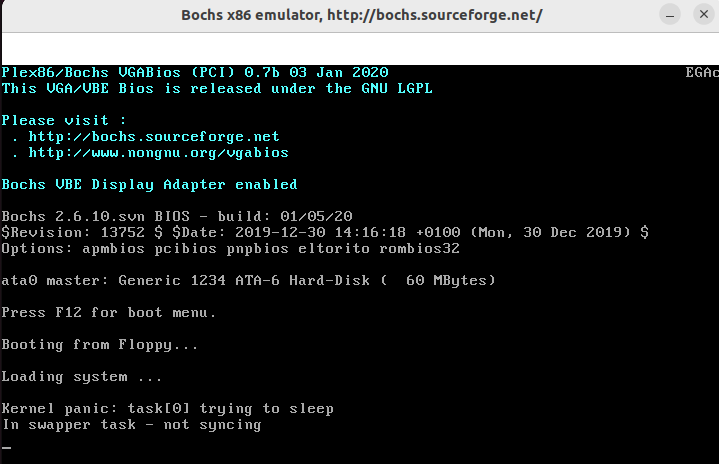
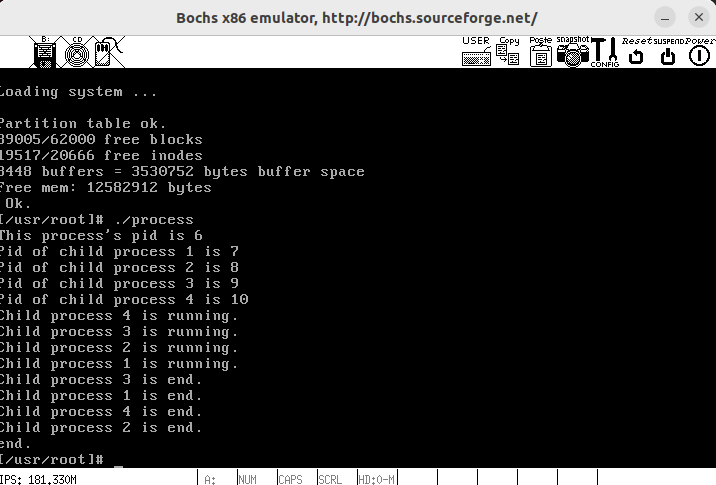
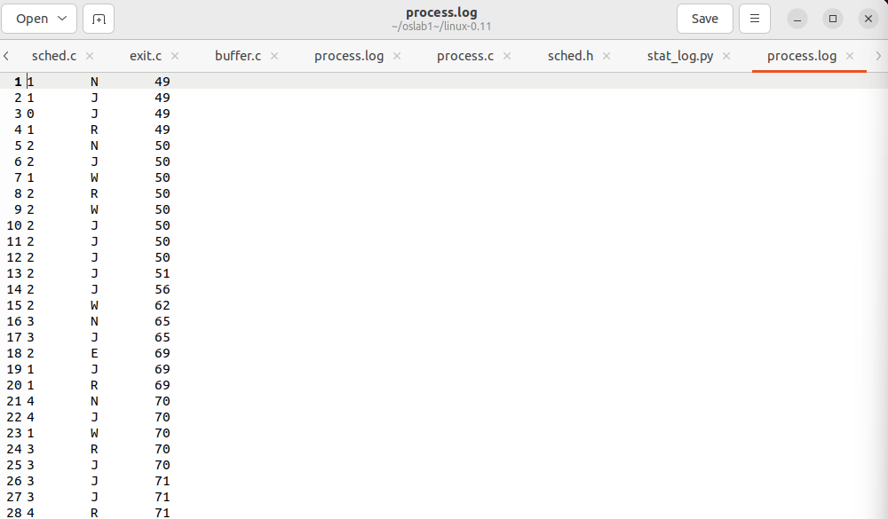
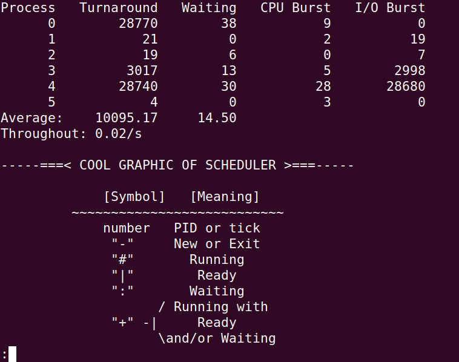
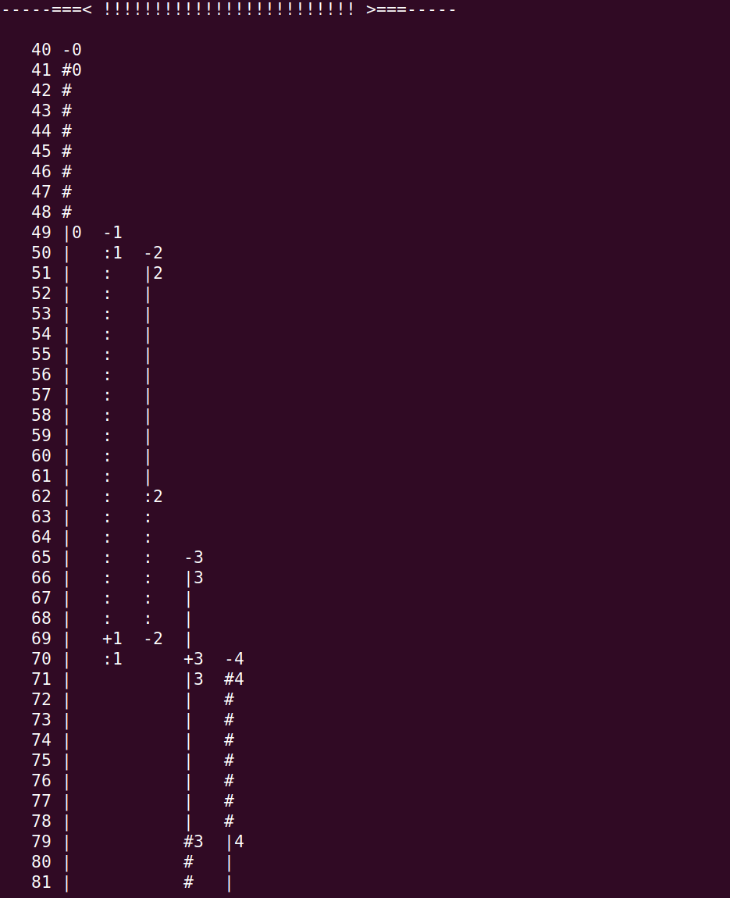
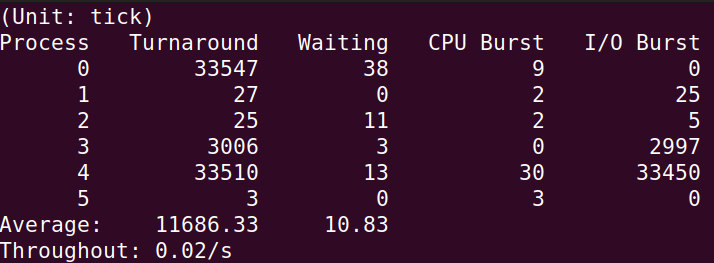
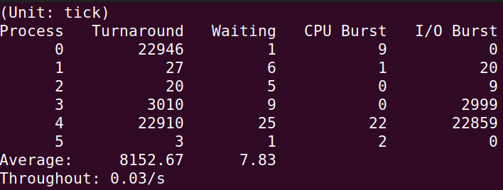
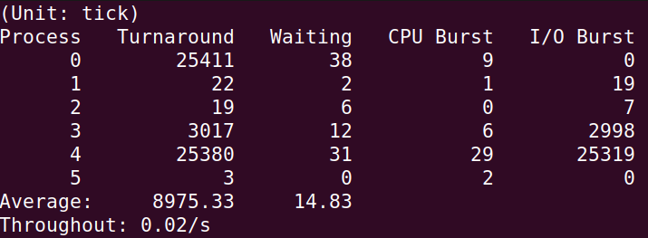
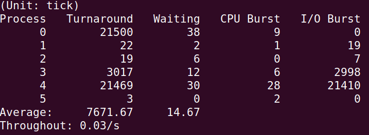

# 实验五 进程运行轨迹的跟踪与统计

## 实验过程

### 修改`init/main.c`文件

建立文件描述符`0,1,2`，当三个描述符关联之后才可以打开`log`文件记录进程的运行轨迹

```
move_to_user_mode();
	setup((void *) &drive_info);
	(void) open("/dev/tty0",O_RDWR,0);    
	(void) dup(0);        
	(void) dup(0);        
	(void) open("/var/process.log",O_CREAT|O_TRUNC|O_WRONLY,0666);
	if (!fork()) {		/* we count on this going ok */
		init();
	}
```

在`move_to_user_mode();`后加入所示代码

### 在`kernel/printk.c`增加打印函数

由于不能在内核状态调用`printf()`，因此参考`printk()`写出`fprintk()`函数

```
#include <linux/sched.h>
#include <sys/stat.h>

static char logbuf[1024];
int fprintk(int fd, const char *fmt, ...)
{
    va_list args;
    int count;
    struct file * file;
    struct m_inode * inode;

    va_start(args, fmt);
    count=vsprintf(logbuf, fmt, args);
    va_end(args);

    if (fd < 3)    /* 如果输出到stdout或stderr，直接调用sys_write即可 */
    {
        __asm__("push %%fs\n\t"
            "push %%ds\n\t"
            "pop %%fs\n\t"
            "pushl %0\n\t"
            "pushl $logbuf\n\t" /* 注意对于Windows环境来说，是_logbuf,下同 */
            "pushl %1\n\t"
            "call sys_write\n\t" /* 注意对于Windows环境来说，是_sys_write,下同 */
            "addl $8,%%esp\n\t"
            "popl %0\n\t"
            "pop %%fs"
            ::"r" (count),"r" (fd):"ax","cx","dx");
    }
    else    /* 假定>=3的描述符都与文件关联。事实上，还存在很多其它情况，这里并没有考虑。*/
    {
        // if (!(file=task[0]->filp[fd]))    /* 从进程0的文件描述符表中得到文件句柄 */
        //    return 0;
        
        // 修改为如下：
        // task[1]->filp is not ready or f_inode->i_dev is not ready
        if (!(file=task[1]->filp[fd]) || !task[1]->filp[fd]->f_inode->i_dev) {   /* 从进程1的文件描述符表中得到文件句柄 */
            return 0;
        }
        inode=file->f_inode;

        __asm__("push %%fs\n\t"
            "push %%ds\n\t"
            "pop %%fs\n\t"
            "pushl %0\n\t"
            "pushl $logbuf\n\t"
            "pushl %1\n\t"
            "pushl %2\n\t"
            "call file_write\n\t"
            "addl $12,%%esp\n\t"
            "popl %0\n\t"
            "pop %%fs"
            ::"r" (count),"r" (file),"r" (inode):"ax","cx","dx");
    }
    return count;
}
```

### 在各个进程切换关键点增加打印点来记录观察进程状态

#### 1.进程创建时

在`kernel/fork.c`中修改如下

```
	...
	p->start_time = jiffies;
	
	fprintk(3, "%ld\t%c\t%ld\n", p->pid, 'N', jiffies);
	
	p->tss.back_link = 0;
	...
	
	...
	p->state = TASK_RUNNING;	/* do this last, just in case */
	
	fprintk(3, "%ld\t%c\t%ld\n", p->pid, 'J', jiffies); 
	
	return last_pid;
	...
```

#### 2. 就绪态 - 运行态

在`kernel/sched.c`中修改，一个是在切换到就绪态时记录，一个是当前进程与要切换的进程不同时记录，这是由于运行态和就绪态的值都是`TSAK_RUNNING`，因此需要区分。

```
void schedule(void)
{
	int i,next,c;
	struct task_struct ** p;

/* check alarm, wake up any interruptible tasks that have got a signal */

	for(p = &LAST_TASK ; p > &FIRST_TASK ; --p)
		if (*p) {
			if ((*p)->alarm && (*p)->alarm < jiffies) {
					(*p)->signal |= (1<<(SIGALRM-1));
					(*p)->alarm = 0;
				}
			if (((*p)->signal & ~(_BLOCKABLE & (*p)->blocked)) &&
			(*p)->state==TASK_INTERRUPTIBLE){
				(*p)->state=TASK_RUNNING;//切换到就绪态
				fprintk(3,"%d\tJ\t%d\n",(*p)->pid,jiffies);}
		}
/* this is the scheduler proper: */
//如果当前进程和要切换的进程一样，相当于没有切换。在 switch_to 函数中一开始就进行这个验证。
//只有当前运行进程不等于要切换的进程 才需要进行记录。
	while (1) {
		c = -1;
		next = 0;
		i = NR_TASKS;
		p = &task[NR_TASKS];
		while (--i) {
			if (!*--p)
				continue;
			if ((*p)->state == TASK_RUNNING && (*p)->counter > c)
				c = (*p)->counter, next = i;
		}
		if (c) break;
		for(p = &LAST_TASK ; p > &FIRST_TASK ; --p)
			if (*p)
				(*p)->counter = ((*p)->counter >> 1) +
						(*p)->priority;
	}
	if(current->pid != task[next] ->pid)
    	{
		if(current->state == TASK_RUNNING)
		    fprintk(3,"%d\tJ\t%d\n",current->pid,jiffies);
		fprintk(3,"%d\tR\t%d\n",task[next]->pid,jiffies);
    	}
	switch_to(next);
```

#### 3. 运行态 - 睡眠

从运行态切换到不可中断睡眠态时记录

`kernel/sched.c`中`sleep_on`函数

```
void sleep_on(struct task_struct **p)
{
	struct task_struct *tmp;

	if (!p)
		return;
	if (current == &(init_task.task))
		panic("task[0] trying to sleep");
	tmp = *p;
	*p = current;
	current->state = TASK_UNINTERRUPTIBLE;
	
	fprintk(3, "%ld\t%c\t%ld\n", current->pid, 'W', jiffies); 
	
	schedule();
	if (tmp){
		tmp->state=0;
		fprintk(3, "%ld\t%c\t%ld\n", tmp->pid, 'J', jiffies); }
}
```

从运行态到可中断睡眠态时也需要记录

`kernel/sched.c`中`interruptible_sleep_on`函数

```
void interruptible_sleep_on(struct task_struct **p)
{
	struct task_struct *tmp;

	if (!p)
		return;
	if (current == &(init_task.task))
		panic("task[0] trying to sleep");
	tmp=*p;
	*p=current;
repeat:	current->state = TASK_INTERRUPTIBLE;
	fprintk(3, "%ld\t%c\t%ld\n", current->pid, 'W', jiffies);
	schedule();
	if (*p && *p != current) {
		(**p).state=0;
		fprintk(3, "%ld\t%c\t%ld\n", (*p)->pid, 'J', jiffies); 
		goto repeat;
	}
	*p=NULL;
	if (tmp){
		tmp->state=0;
		fprintk(3, "%ld\t%c\t%ld\n", tmp->pid, 'J', jiffies); }
}
```
`kernel/sched.c`中`sys_pause`函数,进程主动睡觉的系统调用。

这里添加一个`if`判断，是因为在没有其它进程运行时，进程0不管状态是啥，会一直调用这个`sys_pause()`。

```
int sys_pause(void)
{
	current->state = TASK_INTERRUPTIBLE;
	if(current->pid != 0)
    		fprintk(3, "%ld\t%c\t%ld\n", current->pid, 'W', jiffies);
	schedule();
	return 0;
}
```
`kernel/exit.c`中`sys_waitpid`函数,进程等子进程结束的系统调用。

```
	if (flag) {
		if (options & WNOHANG)
			return 0;
		current->state=TASK_INTERRUPTIBLE;
		if(current->pid != 0)
        		fprintk(3, "%ld\t%c\t%ld\n", current->pid, 'W', jiffies);
		schedule();
		if (!(current->signal &= ~(1<<(SIGCHLD-1))))
			goto repeat;
		else
			return -EINTR;
	}
	return -ECHILD;
}
```

#### 4. 睡眠态 - 就绪态

`kernel/sched.c`中`wake_up`函数

```
void wake_up(struct task_struct **p)
{
	if (p && *p) {
		(**p).state=0;
		fprintk(3,"%d\tJ\t%d\n",(*p)->pid,jiffies);
		*p=NULL;
	}
}
```

#### 5. 运行态 - 僵死

`kernel/exit.c`中和`do_exit`函数

```
current->state = TASK_ZOMBIE;
	
	fprintk(3, "%ld\t%c\t%ld\n", current->pid, 'E', jiffies); 
	
	current->exit_code = code;
	tell_father(current->father);
	schedule();
```

### 编写`process.c`文件

用 `fork()` 建立若干个同时运行的子进程，父进程等待所有子进程退出后才退出

```
#define __LIBRARY__
#include <unistd.h>
#include <stdio.h>
#include <time.h>
#include <sys/times.h>
#include <sys/wait.h>

#define HZ 100

void cpuio_bound(int last, int cpu_time, int io_time);

int main(int argc, char *argv[]) {
    pid_t pid1, pid2, pid3, pid4;

    pid1 = fork();
    if (pid1 < 0) {
        printf("error in fork! errno=%d\n", pid1);
    } else if (pid1 == 0) {
        printf("Child process 1 is running.\n");
        cpuio_bound(10, 1, 0);
        printf("Child process 1 is end.\n");
        return 0;
    }

    pid2 = fork();
    if (pid2 < 0) {
        printf("error in fork! errno=%d\n", pid2);
    } else if (pid2 == 0) {
        printf("Child process 2 is running.\n");
        cpuio_bound(10, 0, 1);
        printf("Child process 2 is end.\n");
        return 0;
    }

    pid3 = fork();
    if (pid3 < 0) {
        printf("error in fork! errno=%d\n", pid3);
    } else if (pid3 == 0) {
        printf("Child process 3 is running.\n");
        cpuio_bound(10, 1, 1);
        printf("Child process 3 is end.\n");
        return 0;
    }

    pid4 = fork();
    if (pid4 < 0) {
        printf("error in fork! errno=%d\n", pid4);
    } else if (pid4 == 0) {
        printf("Child process 4 is running.\n");
        cpuio_bound(10, 1, 9);
        printf("Child process 4 is end.\n");
        return 0;
    }

    printf("This process's pid is %d\n", getpid());
    printf("Pid of child process 1 is %d\n", pid1);
    printf("Pid of child process 2 is %d\n", pid2);
    printf("Pid of child process 3 is %d\n", pid3);
    printf("Pid of child process 4 is %d\n", pid4);

    wait(NULL);
    wait(NULL);
    wait(NULL);
    wait(NULL);

    printf("end.\n");
    return 0;
}

void cpuio_bound(int last, int cpu_time, int io_time) {	
    struct tms start_time, current_time;
    clock_t utime, stime;
    int sleep_time;

    while (last > 0) {
        times(&start_time);
        do {
            times(&current_time);
            utime = current_time.tms_utime - start_time.tms_utime;
            stime = current_time.tms_stime - start_time.tms_stime;
        } while (((utime + stime) / HZ) < cpu_time);
        last -= cpu_time;

        if (last <= 0)
            break;

        sleep_time = 0;
        while (sleep_time < io_time) {
            sleep(1);
            sleep_time++;
        }
        last -= sleep_time;
    }
}
```

### `make`并运行`process`程序

报错如下



网上查找资料发现0号进程通常是操作系统内核的一部分，也称为内核线程。这个进程通常是在系统启动时创建的，并且负责管理系统资源、调度其他进程等关键任务。因为0号进程是系统的核心部分，让它进入睡眠状态可能会导致系统崩溃或无法正常工作。

根据资料修改`fs/buffer.c`文件

```
struct buffer_head * bread(int dev,int block)
{
	struct buffer_head * bh;
	if (!(bh=getblk(dev,block))) {
		panic("bread: getblk returned NULL\n");
	}
	if (bh->b_uptodate) {
		return bh;
	}

	ll_rw_block(READ,bh);

	if(current->pid == 0) {
		while(1) {

		    wake_up(&bh->b_wait);
			if (bh->b_uptodate) {
				return bh;
			}
		}
	}else {
		wait_on_buffer(bh);
	}
	if (bh->b_uptodate) {
		return bh;
	}
	brelse(bh);
	return NULL;
}
```

再次编译，成功运行



### 将输出的`process.log`拷贝出来并分析

打开`process.log`部分内容如下



然后编写`stat_log.py`分析

```
#!/usr/bin/python
import sys
import copy

P_NULL = 0
P_NEW = 1
P_READY = 2
P_RUNNING = 4
P_WAITING = 8
P_EXIT = 16
S_STATE = 0
S_TIME = 1
HZ = 100

graph_title = r"""
-----===< COOL GRAPHIC OF SCHEDULER >===-----

             [Symbol]   [Meaning]
         ~~~~~~~~~~~~~~~~~~~~~~~~~~~
             number   PID or tick
              "-"     New or Exit 
              "#"       Running
              "|"        Ready
              ":"       Waiting
                    / Running with 
              "+" -|     Ready 
                    \and/or Waiting

-----===< !!!!!!!!!!!!!!!!!!!!!!!!! >===-----
"""
usage = """
Usage:
%s /path/to/process.log [PID1] [PID2] ... [-x PID1 [PID2] ... ] [-m] [-g]

Example:
# Include process 6, 7, 8 and 9 in statistics only. (Unit: tick)
%s /path/to/process.log 6 7 8 9

# Exclude process 0 and 1 from statistics. (Unit: tick)
%s /path/to/process.log -x 0 1

# Include process 6 and 7 only and print a COOL "graphic"! (Unit: millisecond)
%s /path/to/process.log 6 7 -m -g

# Include all processes and print a COOL "graphic"! (Unit: tick)
%s /path/to/process.log -g
"""

class MyError(Exception):
    pass

class DuplicateNew(MyError):
    def __init__(self, pid):
	    args = "More than one 'N' for process %d." % pid
	    MyError.__init__(self, args)

class UnknownState(MyError):
    def __init__(self, state):
	    args = "Unknown state '%s' found." % state
	    MyError.__init__(self, args)

class BadTime(MyError):
    def __init__(self, time):
	    args = "The time '%d' is bad. It should >= previous line's time." % time
	    MyError.__init__(self, args)

class TaskHasExited(MyError):
    def __init__(self, state):
	    args = "The process has exited. Why it enter '%s' state again?" % state
	    MyError.__init__(self, args)

class BadFormat(MyError):
    def __init__(self):
	    args = "Bad log format"
	    MyError.__init__(self, args)

# class RepeatState(MyError):
# 	def __init__(self, pid):
# 		args = "Previous state of process %d is identical with this line." % (pid)
# 		MyError.__init__(self, args)

# class SameLine(MyError):
# 	def __init__(self):
# 		args = "It is a clone of previous line."
# 		MyError.__init__(self, args)

class NoNew(MyError):
	def __init__(self, pid, state):
		args = "The first state of process %d is '%s'. Why not 'N'?" % (pid, state)
		MyError.__init__(self, args)

class statistics:
	def __init__(self, pool, include, exclude):
		if include:
			self.pool = process_pool()
			for process in pool:
				if process.getpid() in include:
					self.pool.add(process)
		else:
			self.pool = copy.copy(pool)

		if exclude:
			for pid in exclude:
				if self.pool.get_process(pid):
					self.pool.remove(pid)

	def list_pid(self):
		l = []
		for process in self.pool:
			l.append(process.getpid())
		return l

	def average_turnaround(self):
		if len(self.pool) == 0:
			return 0
		sum = 0
		for process in self.pool:
			sum += process.turnaround_time()
		return float(sum) / len(self.pool)

	def average_waiting(self):
		if len(self.pool) == 0:
			return 0
		sum = 0
		for process in self.pool:
			sum += process.waiting_time()
		return float(sum) / len(self.pool)

	def begin_time(self):
		begin = 0xEFFFFF
		for p in self.pool:
			if p.begin_time() < begin:
				begin = p.begin_time()
		return begin

	def end_time(self):
		end = 0
		for p in self.pool:
			if p.end_time() > end:
				end = p.end_time()
		return end

	def throughput(self):
		return len(self.pool) * HZ / float(self.end_time() - self.begin_time())

	def print_graphic(self):
		begin = self.begin_time()
		end = self.end_time()

		print graph_title

		for i in range(begin, end+1):
			line = "%5d " % i
			for p in self.pool:
				state = p.get_state(i)
				if state & P_NEW:
					line += "-"
				elif state == P_READY or state == P_READY | P_WAITING:
					line += "|"
				elif state == P_RUNNING:
					line += "#"
				elif state == P_WAITING:
					line += ":"
				elif state & P_EXIT:
					line += "-"
				elif state == P_NULL:
					line += " "
				elif state & P_RUNNING:
					line += "+"
				else:
					assert False
				if p.get_state(i-1) != state and state != P_NULL:
					line += "%-3d" % p.getpid()
				else:
					line += "   "
			print line

class process_pool:
	def __init__(self):
		self.list = []

	def get_process(self, pid):
		for process in self.list:
			if process.getpid() == pid:
				return process
		return None

	def remove(self, pid):
		for process in self.list:
			if process.getpid() == pid:
				self.list.remove(process)

	def new(self, pid, time):
		p = self.get_process(pid)
		if p:
			if pid != 0:
				raise DuplicateNew(pid)
			else:
				p.states=[(P_NEW, time)]
		else:
			p = process(pid, time)
			self.list.append(p)
		return p

	def add(self, p):
		self.list.append(p)

	def __len__(self):
		return len(self.list)

	def __iter__(self):
		return iter(self.list)

class process:
	def __init__(self, pid, time):
		self.pid = pid
		self.states = [(P_NEW, time)]

	def getpid(self):
		return self.pid

	def change_state(self, state, time):
		last_state, last_time = self.states[-1]
		if state == P_NEW:
			raise DuplicateNew(pid)
		if time < last_time:
			raise BadTime(time)
		if last_state == P_EXIT:
			raise TaskHasExited(state)
		#if last_state == state and self.pid != 0: # task 0 can have duplicate state
		#	raise RepeatState(self.pid)

		self.states.append((state, time))

	def get_state(self, time):
		rval = P_NULL
		combo = P_NULL
		if self.begin_time() <= time <= self.end_time():
			for state, s_time in self.states:
				if s_time < time:
					rval = state
				elif s_time == time:
					combo |= state
				else:
					break
			if combo:
				rval = combo
		return rval

	def turnaround_time(self):
		return self.states[-1][S_TIME] - self.states[0][S_TIME]

	def waiting_time(self):
		return self.state_last_time(P_READY)

	def cpu_time(self):
		return self.state_last_time(P_RUNNING)

	def io_time(self):
		return self.state_last_time(P_WAITING)

	def state_last_time(self, state):
		time = 0
		state_begin = 0
		for s,t in self.states:
			if s == state:
				state_begin = t
			elif state_begin != 0:
				assert state_begin <= t
				time += t - state_begin
				state_begin = 0
		return time


	def begin_time(self):
		return self.states[0][S_TIME]

	def end_time(self):
		return self.states[-1][S_TIME]
	
# Enter point
if len(sys.argv) < 2:
	print usage.replace("%s", sys.argv[0])
	sys.exit(0)

# parse arguments
include = []
exclude = []
unit_ms = False
graphic = False
ex_mark = False

try:
	for arg in sys.argv[2:]:
		if arg == '-m':
			unit_ms = True
			continue
		if arg == '-g':
			graphic = True
			continue
		if not ex_mark:
			if arg == '-x':
				ex_mark = True
			else:
				include.append(int(arg))
		else:
			exclude.append(int(arg))
except ValueError:
	print "Bad argument '%s'" % arg
	sys.exit(-1)

# parse log file and construct processes
processes = process_pool()

f = open(sys.argv[1], "r")

# Patch process 0's New & Run state
processes.new(0, 40).change_state(P_RUNNING, 40)

try:
	prev_time = 0
	prev_line = ""
	for lineno, line in enumerate(f):

		# if line == prev_line:
		# 	raise SameLine
		prev_line = line

		fields = line.split("\t")
		if len(fields) != 3:
			raise BadFormat

		pid = int(fields[0])
		s = fields[1].upper()

		time = int(fields[2])
		if time < prev_time:
			raise BadTime(time)
		prev_time = time

		p = processes.get_process(pid)

		state = P_NULL
		if s == 'N':
			processes.new(pid, time)
		elif s == 'J':
			state = P_READY
		elif s == 'R':
			state = P_RUNNING
		elif s == 'W':
			state = P_WAITING
		elif s == 'E':
			state = P_EXIT
		else:
			raise UnknownState(s)
		if state != P_NULL:
			if not p:
				raise NoNew(pid, s)
			p.change_state(state, time)
except MyError, err:
	print "Error at line %d: %s" % (lineno+1, err)
	sys.exit(0)

# Stats
stats = statistics(processes, include, exclude)
att = stats.average_turnaround()
awt = stats.average_waiting()
if unit_ms:
	unit = "ms"
	att *= 1000/HZ
	awt *= 1000/HZ
else:
	unit = "tick"
print "(Unit: %s)" % unit
print "Process   Turnaround   Waiting   CPU Burst   I/O Burst"
for pid in stats.list_pid():
	p = processes.get_process(pid)
	tt = p.turnaround_time()
	wt = p.waiting_time()
	cpu = p.cpu_time()
	io = p.io_time()

	if unit_ms:
		print "%7d   %10d   %7d   %9d   %9d" % (pid, tt*1000/HZ, wt*1000/HZ, cpu*1000/HZ, io*1000/HZ)
	else:
		print "%7d   %10d   %7d   %9d   %9d" % (pid, tt, wt, cpu, io)
print "Average:  %10.2f   %7.2f" % (att, awt)
print "Throughout: %.2f/s" % (stats.throughput())

if graphic:
	stats.print_graphic()
```

命令行`./stat_log.py process.log 0 1 2 3 4 5 -g | less`查看结果





### 修改时间片

在`include/linux/sched.h`中发现如下内容

```
#define INIT_TASK \
/* state etc */	{ 0,15,15, \
```

其中三个数值分别对应`state`，`counter`和`priority`

我们分别修改`priority`为2，32，100进行试验

`priority`为2：



`priority`为32：



`priority`为100：



`priority`为150：



### 1）结合自己的体会，谈谈从程序设计者的角度看，单进程编程和多进程编程最大的区别是什么？

#### 单进程编程

集中化，逻辑清晰，顺序执行，性能上受限于单核 CPU，性能较低，但是实现简单，调试方便。

不过可靠性方面单点故障可能导致整个程序崩溃，无需切换上下文，运行开销小。

适用于单任务、计算密集型场景。

------

#### 多进程编程

分散化，需设计多进程间的协作和协调；由于支持并行执行，充分利用多核硬件资源，因此性能上优于单进程。

不过因为涉及进程间通信、同步、竞争问题，所以复杂度较高。鲁棒性较高，单个进程故障不影响其他进程。

拥有独立资源空间，进程创建、销毁、切换需要较大开销。

适用于多任务、需要并行处理或高可靠性的场景。

### 2）你是如何修改时间片的？仅针对样本程序建立的进程，在修改时间片前后，log 文件的统计结果（不包括 Graphic）都是什么样？结合你的修改分析一下为什么会这样变化，或者为什么没变化？

通过修改`include/linux/sched.h`中的`INIT_TASK`来修改时间片。

通过对比发现，在周转时间上，CPU 密集型任务在优先级较低时（如 `priority = 2`）占据更多 CPU，导致 I/O 密集型任务的周转时间延长。随着优先级提高（如 `priority = 150`），I/O 密集型任务的响应时间缩短，系统整体周转时间降低。

对于等待时间，I/O 密集型任务的等待时间在较高优先级时显著减少，因为时间片较短，调度频率增加。

吞吐量在优先级适中（如 `priority = 32` 或 `priority = 150`）时达到最高，这是因为系统对 CPU 和 I/O 密集型任务的调度更均衡。