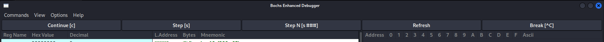

# 调试分析Linux0.00引导程序

班级：2203202 

学号：2022112266 

姓名：魏圣卓

2024 年 11 月 23 日

---

## 1.1. 实验目的

熟悉实验环境；

掌握如何手写Bochs虚拟机的配置文件；

掌握Bochs虚拟机的调试技巧；

掌握操作系统启动的步骤；

## 1.2. 实验内容

### 1.2.1. 掌握如何手写Bochs虚拟机的配置文件

#### 简介 Bochs 虚拟机的配置文件

Bochs 的配置文件通常是一个文本文件，包含了虚拟机的各种设置和参数。在本实验中该配置文件为 linux000_gui.bxrc

基本设置：

ROMIMAGE:将一个ROMBIOS导入到F0000-FFFFF.这一项需要填写一个到BIOS的
地址. 在BOCHS的目录下有预先编译好的最新的BIOS, 可以借用. 在这里用到的
是BIOS-bochs-latest

VGAROMIMAGE:用此项值指出一个VGAROMBIOS,需要将其导入到C000处.

FLOPPYA: 指明松散映像文件(floppya image file)路径. 如果从’a’盘启动, 那么需
要一个bootable的image. 另外可以设置“status”,其可以指定为ejected,或是inserted.

BOOT: 此项定义了boot驱动, 可以从a, c或是cdrom中选择.

romimage: file="BIOS.img": 指定 BIOS 镜像文件。


#### 如何设置从软驱启动


1. 将镜像文件放到bochs的目录下.
2. 在配置文件中指定软盘的路径,如
``` 
floppya: 1_44="Image", status=inserted
```
3. 在配置文件中指定从软盘启动
```
boot: a
```


#### 如何设置从硬盘启动


1. 将镜像文件放到bochs的目录下.
2. 在配置文件中指定硬盘的路径,如
```
ata0-master: type=disk, path="disk.img", mode=flat
```
3. 在配置文件中指定从硬盘启动
```
boot: c
```

#### 如何设置调试选项

1. 在配置文件中指定调试选项
```
log: bochsout.txt
```
```
debugger_log: bochsdbg.txt
```
```
debug: action=ignore
```

### 1.2.2. 掌握Bochs虚拟机的调试技巧

#### 如何单步跟踪？


输入s命令即可单步执行，每次输入s命令，虚拟机将执行当前指令并停在下一条指令
之前。

#### 如何设置断点进行调试？

使用b+地址命令设置断点，再点击运行，bochs就会在断点位置停止



#### 如何查看通用寄存器的值？

左边蓝色部分

#### 如何查看系统寄存器的值？

左边紫色部分


#### 如何查看内存指定位置的值？

使用 `x` 指令
```
x /<count> <format> <address>
```
如 

```
x /10x 0x7c00
```

#### 如何查看各种表，如 gdt ，idt ，ldt 等？

view 选项可以直接查看


#### 如何查看 TSS？

输入 `info tss` 即可查看


#### 如何查看栈中的内容？

在 `view` 中选择 `stack` 即可查看


#### 如何在内存指定地方进行反汇编？

使用 `disasm` 命令
```
disasm <address> <count>
```
如
```
disasm 0x03 32
```


### 1.2.3. 计算机引导程序

#### 如何查看 0x7c00 处被装载了什么？

直接在 `0x7c00` 处打一个断点，然后查看内存即可

或者使用

```
x /100wd 0x7c00
```


#### 如何把真正的内核程序从硬盘或软驱装载到自己想要放的地方;

利用 `boot.s` 中的代码，将内核程序从软盘中读取到内存的指定位置，并设置临时 GDT 表，然后跳转到内核程序的入口地址。

实际上，会使用 BIOS 的 `int 0x13` 中断来读取软盘的内容。读取到的内容会被放到 `0x10000` 处。

#### 如何查看实模式的中断程序？

在实模式下，中断向量表位于内存地址 0x0000 到 0x03FF。每个中断向量占用 4 个字节，其中前 2 个字节是中断处理程序的段地址，后 2 个字节是偏移地址。

使用命令 `x/256w 0x0000` 即可查看。

#### 如何静态创建 gdt 与 idt ？

静态创建 GDT

确定每个 GDT 项的结构，包括段的基地址、限长和访问权限等属性。创建一个 GDT 数组，并为每个段（如代码段、数据段和任务状态段）设置相应的属性。使用特定的 CPU 指令（如 lgdt）将 GDT 加载到处理器中，以便系统能够使用这些段描述符。

静态创建 IDT

确定每个 IDT 项的结构，包括中断处理程序的地址和中断的特性（如权限级别）。创建一个 IDT 数组，并为每个中断源（如硬件中断和软件中断）设置相应的处理程序地址和属性。使用特定的 CPU 指令（如 lidt）将 IDT 加载到处理器中，以便系统能够响应中断。


#### 如何从实模式切换到保护模式？


1. **关闭中断**：在切换模式之前，首先需要禁用中断，以防在切换过程中发生中断。

2. **设置全局描述符表**：创建并初始化 GDT，定义代码段和数据段的描述符。保护模式依赖于 GDT 来管理内存访问。

3. **加载 GDT**：使用 `lgdt` 指令加载 GDT。需要设置 GDTR 寄存器，指向 GDT 的基地址和大小。

4. **设置控制寄存器**：将控制寄存器 CR0 的 PE位设置为 1。这可以通过执行 `mov` 指令来完成。

5. **远跳转到保护模式代码**：执行一个远跳转指令，跳转到保护模式下的代码段。这将使 CPU 切换到保护模式，并加载新的段寄存器。

6. **初始化段寄存器**：在保护模式下，初始化段寄存器以指向新的段描述符。

7. **重新启用中断**：最后，重新启用中断，以允许系统响应外部事件。


#### 调试跟踪 jmpi 0,8 ，解释如何寻址？

先在    0x7c00 处打断点，然后单步执行，可以看到 `jmpi 0,8` 的汇编代码，


然后在 `0x7c4c` 处打断点，


再单步执行，可以看到 `jmpi 0,8` 的跳转地址为 `0x0000`。


检查段选择子与cs值的对应情况, 在内核模式下查找GDT的第1项. 是基地址在0x0的可读可执行的代码段, 将基地址与偏移相加,即寻址到了0x0位置

## 1.3. 实验报告
通过仔细的调试与跟踪程序，完成以下任务：

#### 请简述 head.s 的工作原理

`head.s` 通常是操作系统引导过程中的一部分，尤其是在 Linux 内核或其他类 Unix 系统中。它的主要作用是设置系统的初始状态，为内核的启动做准备。

- **引导加载程序**：：计算机启动时，处理器会加载引导设备的引导扇区（通常位于磁盘的第
一个扇区）到内存地址0x7C00。这个扇区通常包含了 `head.s` 的代码。

- **从实模式切换到保护模式**：`head.s` 中的代码负责将 CPU 从实模式切换到保护模式。这通常涉及设置全局描述符表和控制寄存器，以启用保护模式。

- **设置段寄存器**：在保护模式下，`head.s` 会初始化段寄存器，以确保它们指向正确的段描述符。

- **初始化堆栈**：代码会设置堆栈指针，确保在保护模式下有一个有效的堆栈，以便后续的函数调用和中断处理。

运行时打印 A B 截图：


初始化 GDT 和 IDT 截图：


初始化时钟中断截图：


初始化时钟芯片截图：


转移到 Task0 截图：


Task0 和 Task1 :


#### 请记录 head.s 的内存分布状况，写明每个数据段，代码段，栈段的起始与终止的内存地址

初始栈在 0x9d8-0xbd8

内核栈在 0xc60-0x10e0

用户栈在 0x1108-0x1308


查看 GDT 表：


发现 GDT 表中的代码段和数据段

0x08 是代码段，0x10 是数据段，大小均为 8MB，即为 0x7fffff


#### 简述 head.s 57 至 62 行在做什么？


感觉行数描述有问题，上网找了一下，感觉应该是指代 69-74 行


主要目的就在于，为了切换到任务0，需要将任务0的堆栈段选择子、堆栈指针、标志寄存器、代码段选择子和入口地址压入栈中，然后使用 `iret` 指令从栈中弹出这些值，恢复任务0的状态并开始执行任务0的代码。可以逐行分析：

1. `pushl $0x17`  将任务0的堆栈段选择子（SS）压入栈中。选择子0x17通常指向一个特定的段描述符，表示任务0的堆栈段。

2. `pushl $init_stack`  将任务0的初始堆栈指针（即堆栈的地址）压入栈中。`init_stack`是一个指向任务0堆栈的地址，操作系统在切换到任务0时需要使用这个堆栈。

3. `pushfl`  将当前的标志寄存器（EFLAGS）压入栈中。EFLAGS寄存器包含了当前的状态标志和控制标志，保存它的值是为了在任务切换后能够恢复之前的状态。

4. `pushl $0x0f`  将任务0的代码段选择子（CS）压入栈中。选择子0x0f通常指向任务0的代码段描述符，表示任务0的代码段。

5. `pushl $task0`  将任务0的入口地址（即任务0的代码起始地址）压入栈中。`task0`是一个指向任务0代码的指针，操作系统在切换到任务0时需要跳转到这个地址执行代码。

6. `iret`  用于从中断或任务切换中返回。它会从栈中弹出之前压入的值，恢复EFLAGS、CS和指令指针（IP），从而使CPU开始执行任务0的代码。


#### 简述 iret 执行后， pc 如何找到下一条指令？


1. **栈操作**：`iret` 指令会从栈中依次弹出三个值：
   - 第一个值是之前保存的代码段选择子（CS）。
   - 第二个值是之前保存的指令指针（IP 或 EIP），即下一条要执行的指令的地址。
   - 第三个值是之前保存的标志寄存器（EFLAGS）。

2. **恢复 CS 和 IP**：
   - `iret` 指令首先弹出 IP（或 EIP），这将成为新的指令指针，指向下一条要执行的指令。
   - 然后，`iret` 会将弹出的 CS 值加载到代码段寄存器中。

3. **执行跳转**：在 `iret` 指令完成后，CPU 会将 IP 设置为弹出的指令指针值，并将 CS 设置为弹出的代码段选择子。此时，程序计数器（PC）指向新的指令地址，CPU 将从这个地址开始执行下一条指令。

#### 记录 iret 执行前后，栈是如何变化的？

给 iret 打一个断点


此时的栈：


步进执行 iret 指令


发现栈顶自下的5个内容分别为 IP、CS、EFLAGS、SP、SS，均被弹出。

#### 当任务进行系统调用时，即 int 0x80 时，记录栈的变化情况。

继续步进执行，直到 int 0x80

此时的栈：


再次步进执行 int 0x80, 会发现栈中的内容发生了变化


当执行 int 0x80 指令时，CPU 会进行以下操作：

保存当前的执行状态：

CPU 会将当前的 EFLAGS、CS 和 IP 压入栈中，以便在系统调用完成后能够恢复。

切换到内核模式：

CPU 会切换到内核模式，并根据中断向量表找到对应的系统调用处理程序。

处理程序使用 iret 指令返回到用户态，这会将栈上的内容弹出，恢复到 int$0x80 指令执行前的状态。

连续步进执行，直到执行 iret 指令，可以看到栈中的内容被弹出

栈完全恢复到 int 0x80 之前的状态


### 1.3.1. 评分标准
记录描述要详细完整，每题 15%，总共 90%

格式规范美观，10%

