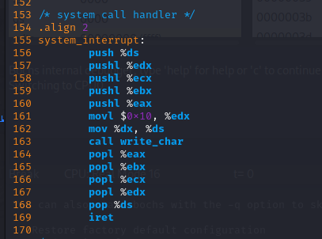
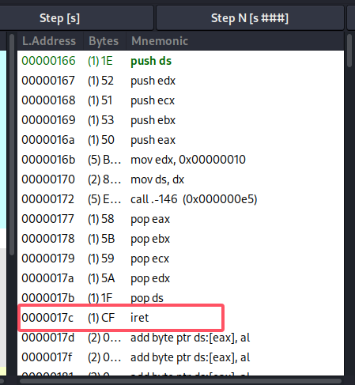
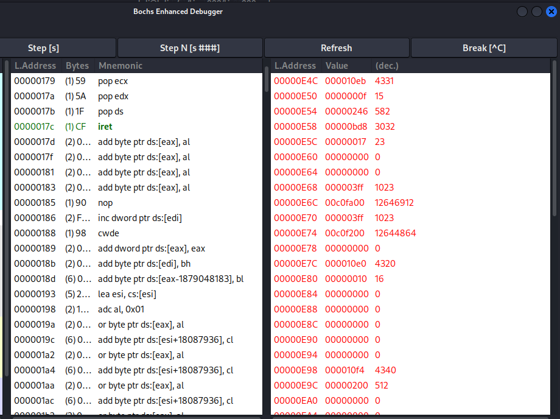
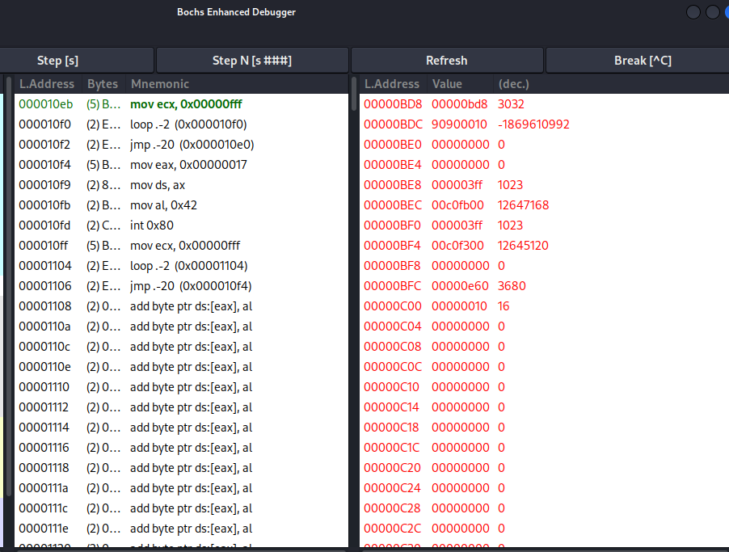
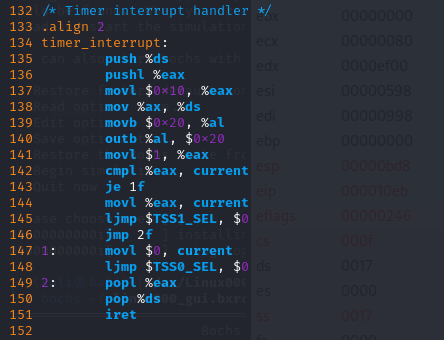
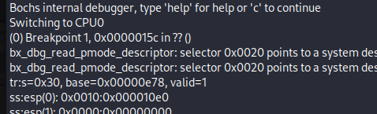
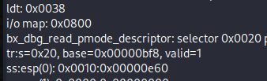
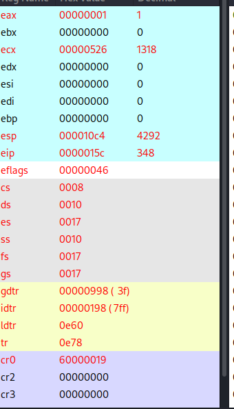
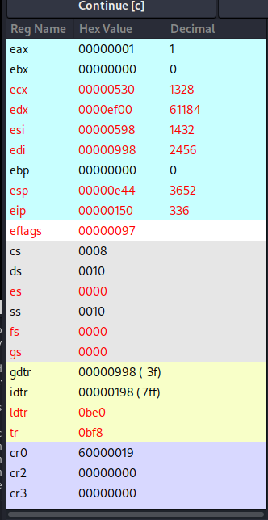

# 2. 调试分析 Linux 0.00 多任务切换

## 2.1. 实验目的

通过调试一个简单的多任务内核实例，使大家可以熟练的掌握调试系统内核的方法；

掌握Bochs虚拟机的调试技巧；

通过调试和记录，理解操作系统及应用程序在内存中是如何进行分配与管理的；

## 2.2. 实验内容

通过调试一个简单的多任务内核实例，使大家可以熟练的掌握调试系统内核的方法。 这个内核示例中包含两个特权级 3 的用户任务和一个系统调用中断过程。我们首先说明这个简单内核的基本结构和加载运行的基本原理，然后描述它是如何被加载进机器 RAM 内存中以及两个任务是如何进行切换运行的。

### 2.2.1. 掌握Bochs虚拟机的调试技巧

>如何单步跟踪？
>
>如何设置断点进行调试？
>
>如何查看通用寄存器的值？
>
>如何查看系统寄存器的值？
>
>如何查看内存指定位置的值？
>
>如何查看各种表，如 gdt ，idt ，ldt 等？
>
>如何查看 TSS？
>
>如何查看栈中的内容？
>
>如何在内存指定地方进行反汇编？

**实验一中已写，不再赘述**

## 2.3. 实验报告

通过仔细的调试与跟踪程序，完成以下任务：

### 当执行完 system_interrupt 函数，执行 153 行 iret 时，记录栈的变化情况。

代码有错位，实际上为 169 行



`iret` 在 `0x17c` 位置，在这里打一个断点



执行 `iret` 前，此时栈顶指针ESP=0xe4c，栈的情况：



执行 `iret` 后，此时栈顶指针ESP=0xbd8，栈的情况：



此时 `CS` 为 `0x0f`，表示切到了特权级别为 3 用户态 ：


### 当进入和退出 system_interrupt 时，都发生了模式切换，请总结模式切换时，特权级是如何改变的？栈切换吗？如何进行切换的？

* 特权级的变化：

当系统发生中断（如 system_interrupt）时，CPU 会从用户模式（特权级 3）切换到内核模式（特权级 0）。这意味着系统可以执行更高权限的操作，如访问硬件资源和执行特权指令。
在中断处理完成后，系统会将控制权返回给用户程序，此时会从内核模式切换回用户模式，特权级恢复为 3。

* 栈切换：

在进入内核模式时，CPU 会切换到内核栈。通常，内核会为每个进程分配一个内核栈，当发生中断时，CPU 会使用该进程的内核栈来保存上下文信息。
进入内核模式时，CPU 会将当前的用户栈指针（ESP）保存，并加载内核栈的指针。这样，内核可以在处理过程中使用内核栈进行数据存储和函数调用。
在中断处理完成后，CPU 会恢复用户栈指针，并返回到用户模式。

* 切换过程：
当中断发生时，CPU 会自动执行以下步骤：

1. 保存当前的 PC 和标志寄存器的状态。
2. 切换到内核模式，特权级提升。
3. 切换到内核栈，更新栈指针。
4. 调用相应的中断处理程序。

中断处理完成后，CPU 会执行返回指令（IRET 或 RET），恢复之前保存的状态，切换回用户模式，特权级降低。


### 当时钟中断发生，进入到 timer_interrupt 程序，请详细记录从任务 0 切换到任务 1 的过程。

在操作系统中，当时钟中断发生时：

1. **时钟中断触发**：
   - 硬件定时器在设定的时间间隔内产生一个时钟中断信号，通知CPU。

2. **中断处理程序的调用**：
   - CPU停止当前正在执行的任务（任务 0），保存其上下文（包括程序计数器、寄存器等）。
   - CPU进入中断服务例程， `timer_interrupt` 函数。



3. **保存寄存器状态**：

在 `timer_interrupt` 中，首先保存当前任务（任务 0）的上下文信息到其任务控制块（TCB）中。保存寄存器状态：

```c
push %ds
pushl %eax
```
4. 切换到内核数据段：

数据段寄存器 ds 切换为内核段（0x10），以便访问内核数据：

```c
movl $0x10, %eax    # 设置数据段选择子
mov %ax, %ds        # 更改 ds 寄存器为内核数据段
```

5. 发送中断结束信号：

```c
movb $0x20, %al
outb %al, $0x20
```

6. 根据当前任务切换下一个任务：

```c
movl $1, %eax
cmpl %eax, current    # 检查当前任务是否为任务 0
je 1f                 # 如果是任务 0，跳转到 1f
movl %eax, current    # 更新当前任务为任务 1
ljmp $TSS1_SEL, $0    # 跳转到任务 1 的代码执行处

movl $0, current      # 更新当前任务为任务 0
ljmp $TSS0_SEL, $0    # 跳转到任务 0 的代码执行处
```

7. **使用 TSS 进行任务切换**：

TSS 用于保存任务的状态信息，包括寄存器的值、堆栈指针、程序计数器等。当任务切换发生时，当前任务的状态会被保存到 TSS 中，以便在下次恢复该任务时能够恢复到之前的执行状态。

TSS 中包含了任务的堆栈指针（SS0 和 ESP0），用于在特权级别切换时（例如从用户态切换到内核态）提供正确的堆栈。这有助于保护内核数据结构，防止用户态程序直接访问内核堆栈。

任务 0 的 TSS（即 tss0）位于 GDT 中，选择符为 TSS0_SEL，而任务 1 的 TSS（即 tss1）位于 GDT 中，选择符为 TSS1_SEL。

当要切换到任务 1 时，CPU 会加载 tss1 中的任务状态信息，包括寄存器的值、堆栈指针等。这样，CPU 就可以从任务 1 的状态继续执行。

当要切换回任务 0 时，CPU 会加载 tss0 中的任务状态信息，恢复任务 0 的执行状态。

8. `iret` 恢复之前任务的上下文：

执行 `iret` 时，会恢复以下几个重要的状态信息：

1. **程序计数器（EIP/RIP）**：恢复到中断发生时的执行位置。
2. **标志寄存器（EFLAGS/RFLAGS）**：恢复中断前的 CPU 状态标志。
3. **堆栈段寄存器（SS）**：恢复堆栈段，以确保正确的堆栈访问。
4. **堆栈指针（ESP/RSP）**：恢复堆栈指针，确保局部变量和返回地址的正确性。


### 又过了 10ms ，从任务1切换回到任务 0 ，整个流程是怎样的？ TSS 是如何变化的？各个寄存器的值是如何变化的？


在`0x15c` jmpf 0x20处打断点，此时 TSS 为 0x30：



单步运行，再执行 `info tss` 查看 TSS 信息，此时 TSS 变成了 0x20：



代表着恢复了任务 0 的状态， EIP 变成了 0x150 ，指向第一次任务切换的下一条地址。


同时切换前后 CS 由 `0x08` 变成 `0x0f` ，意味着从内核态切换到用户态：

执行前后的寄存器变化如下，可以看到 TSS 被恢复进寄存器：




### 请详细总结任务切换的过程。

任务切换的过程通常包括以下几个步骤：

任务切换通常是由中断触发的。在程序中，中断的处理程序是 timer_interrupt。


1. **保存当前任务的状态**：
   - 当操作系统决定切换任务时，首先需要保存当前正在运行任务的上下文（Context），包括程序计数器（PC）、寄存器的值、堆栈指针等。
   - EAX、ECX、EDX、EFLAGS、ESP、CS、EIP等寄存器的状态会保存在 task0的 TSS 中

2. **选择下一个任务**：
   - 操作系统使用调度算法）选择下一个要运行的任务。在本实验中，通过 cmpl 指令，比较当前任务的标识符 current，如果当前任务是任务 0（即 current == 1），就跳转到 1f，否则切换到任务 1。

3. **加载下一个任务的状态**：
   - 从下一个任务的PCB中加载其上下文信息，包括程序计数器、寄存器值等。这一步骤确保CPU能够从上次中断的地方继续执行。
   - 每次任务切换时，当前任务的执行状态（栈指针、段选择子、程序计数器等）会被保存到当前任务的 TSS。任务切换后，目标任务的 TSS 中保存的执行状态会被加载到 CPU 中，使目标任务能够继续从上次中断的地方执行。

4. **切换堆栈**：
   - 在任务切换时，CPU会切换堆栈，以确保正确的堆栈访问。每个任务都有自己的堆栈，用于保存局部变量、函数调用信息等。

5. **特权切换**
   - 如果两个任务的特权级别不同，CPU会在任务切换时进行特权级别的切换。这是通过修改代码段选择子（CS）和堆栈段选择子（SS）来实现的。

6. **切换到新任务**：
   - 最后，操作系统通过修改程序计数器和其他寄存器的值，切换到新任务的执行。

7. **恢复执行**：
   - 一旦切换完成，CPU开始执行新的任务，直到再次发生任务切换或任务完成。

8. **中断返回**：
   - 当任务执行完成后，CPU会执行中断返回指令（IRET），恢复之前保存的状态，继续执行新任务。

任务切换的效率对系统性能有很大影响，频繁的任务切换会导致上下文切换开销增加，从而影响系统的整体性能。因此，操作系统设计时需要在响应时间和切换开销之间找到平衡。


### 2.3.1. 评分标准

记录描述要详细完整，前4项每题 20%，总共 80%

总结任务切换过程，10%

格式规范美观，10%