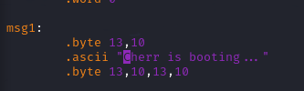
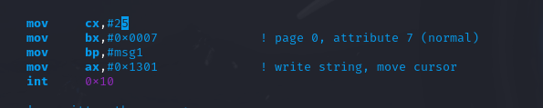
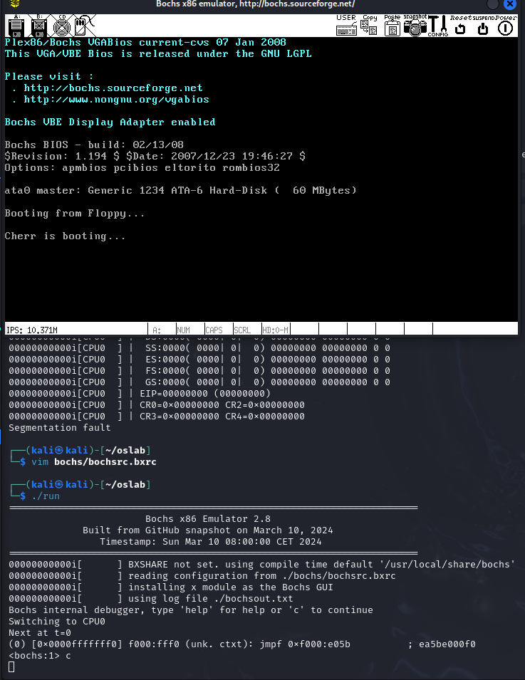
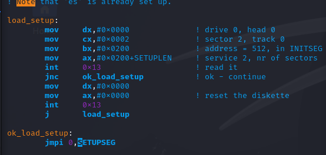
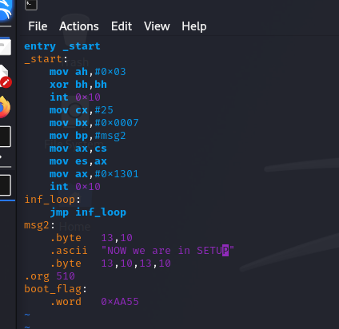
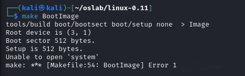
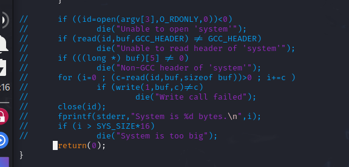
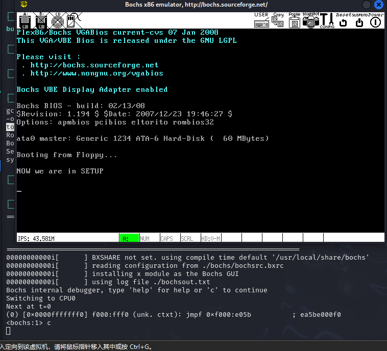
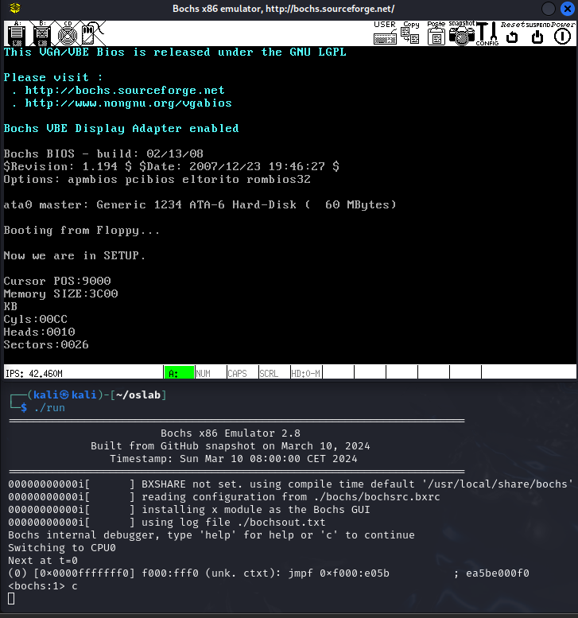

# 3. 操作系统的引导

## 3.1. 实验目的

熟悉实验环境；

建立对操作系统引导过程的深入认识；

掌握操作系统的基本开发过程；

能对操作系统代码进行简单的控制，揭开操作系统的神秘面纱。

## 3.2. 实验内容

阅读《Linux内核完全注释》的第 6 章，对计算机和 Linux 0.11 的引导过程进行初步的了解；

按照下面的要求改写 Linux 0.11 的引导程序 bootsect.s ;

有兴趣同学可以做做进入保护模式前的设置程序 setup.s 。

### 3.2.1. 改写 bootsect.s 主要完成如下功能：

bootsect.s 能在屏幕上打印一段提示信息

XXX is booting...
其中 XXX 是你给自己的操作系统起的名字，也可以显示一个特色 logo ，以表示自己操作系统的与众不同。

修改为 Cherr is booting...

需要查一下字符数，这里有 25 个字符，修改 mov cx #25





然后使用命令编译出 Image 文件

```shell
as86 -0 -a -o bootsect.o bootsect.s
ld86 -0 -s -o bootsect bootsect.o
dd bs=1 if=bootsect of=Image skip=32
cp Image ../
../../run
```

运行结果：




### 3.2.2. 改写 setup.s 主要完成如下功能：

bootsect.s 能完成 setup.s 的载入，并跳转到 setup.s 开始地址执行。而 setup.s 向屏幕输出一行

Now we are in SETUP

先修改 bootsect.s ，将 setup.s 加载

并且加载成功后跳转到 SETUPSEG 开始地址执行




然后修改 setup.s ，输出 Now we are in SETUP




此时输入 make BootImage 会报错



因为 make 根据 Makefile 的指引执行了 tools/build.c ， 它是为生成整个内核的镜像文件而设计的，没考虑我们只需要 bootsect.s 和 setup.s 的情况。 它在向我们要“系统”的核心代码。为完成实验，接下来给它打个小补丁。修改build.c，将其中对于system处理的部分直接注释掉：




此时运行 run 即可得到输出

Cherr is booting...

NOW we are in SETUP 



修改 setup.s 为如下汇编，获取硬件信息并打印：

```assembly
INITSEG = 0x9000          ; 初始化段地址

entry _start              ; 定义入口点，程序开始执行的位置
_start:
    ; 获取当前光标位置，以便将字符串打印到当前光标处
    mov    ah, #0x03      ; 功能号 0x03：获取当前光标位置
    xor    bh, bh         ; bh = 0，获取当前光标位置的页号
    int    0x10           ; 调用 BIOS 中断 0x10 进行操作

    ; 使用 BIOS 中断 0x10 的 0x13 功能打印字符串 "Now we are in SETUP."
    mov    cx, #26        ; 字符串长度为 26
    mov    bx, #0x0007    ; 设置显示属性，字体颜色为白色，背景为黑色
    mov    bp, #msg1      ; 指向要显示的字符串的地址
    mov    ax, cs         ; 将代码段地址加载到 ax
    mov    es, ax         ; 设置 ES 为当前代码段
    mov    ax, #0x1301    ; BIOS 中断 0x10，功能号 0x13 用于打印字符串
    int    0x10           ; 调用 BIOS 中断，打印字符串

    ; 读取一些硬件参数

    ; 读取光标位置并保存到内存地址 0x90000 处
    mov    ax, #INITSEG   ; 初始化数据段为 0x9000
    mov    ds, ax         ; 设置数据段寄存器为 0x9000
    mov    ah, #0x03      ; 功能号 0x03 获取光标位置
    xor    bh, bh         ; bh = 0，表示页号
    int    0x10           ; 调用 BIOS 中断获取光标位置
    mov    [0], ds        ; 将光标位置存储到 0x90000 处

    ; 读取扩展内存的大小，并保存到 0x90002 处
    mov    ah, #0x88      ; 功能号 0x88 用于读取扩展内存大小
    int    0x15           ; 调用 BIOS 中断 0x15 获取内存大小
    mov    [2], ax        ; 将内存大小存储到 0x90002 处

    ; 从 0x41 处拷贝 16 个字节（磁盘参数表）到 0x90004 处
    mov    ax, #0x0000    ; 设置数据段为 0x0000
    mov    ds, ax         ; 设置数据段寄存器为 0x0000
    lds    si, [4*0x41]   ; 加载磁盘参数表地址到 SI
    mov    ax, #INITSEG   ; 将初始化段 0x9000 载入 AX
    mov    es, ax         ; 设置 ES 为 0x9000
    mov    di, #0x0004    ; 设置目的地址为 0x90004
    mov    cx, #0x10      ; 要复制 16 字节
    rep                   ; 重复执行
    movsb                 ; 将字节从 DS:SI 复制到 ES:DI

    ; 开始打印硬件参数

    ; 获取当前光标位置
    mov    ah, #0x03      ; 获取光标位置
    xor    bh, bh         ; bh = 0，页号
    int    0x10           ; 调用 BIOS 中断 0x10 获取光标位置

    ; 打印 "Cursor POS:"
    mov    cx, #11        ; 字符串长度
    mov    bx, #0x0007    ; 显示属性
    mov    ax, cs         ; 设置当前代码段
    mov    es, ax         ; 设置 ES 为当前代码段
    mov    bp, #msg2      ; 指向要显示的字符串
    mov    ax, #0x1301    ; 打印字符串功能
    int    0x10           ; 调用 BIOS 中断打印字符串

    ; 打印光标位置
    mov    ax, #0x9000    ; 数据段设置为 0x9000
    mov    ds, ax         ; 设置数据段寄存器
    mov    dx, 0x0        ; 光标位置存储在 0x90000 处，读取并打印
    call    print_hex     ; 调用打印十六进制数的函数
    call    print_nl      ; 打印换行

    ; 打印内存大小
    mov    ah, #0x03      ; 获取光标位置
    xor    bh, bh         ; bh = 0，页号
    int    0x10           ; 调用 BIOS 中断 0x10 获取光标位置

    ; 打印 "Memory SIZE:"
    mov    cx, #12        ; 字符串长度
    mov    bx, #0x0007    ; 设置显示属性
    mov    ax, cs         ; 设置代码段
    mov    es, ax         ; 设置 ES 为代码段
    mov    bp, #msg3      ; 指向字符串 "Memory SIZE:"
    mov    ax, #0x1301    ; 打印字符串功能
    int    0x10           ; 调用 BIOS 中断打印字符串

    ; 打印内存大小
    mov    ax, #0x9000    ; 数据段设置为 0x9000
    mov    ds, ax         ; 设置数据段寄存器
    mov    dx, 0x2        ; 内存大小存储在 0x90002 处
    call    print_hex     ; 打印内存大小（十六进制）
    call    print_nl      ; 打印换行

    ; 打印 "KB"
    mov    ah, #0x03      ; 获取光标位置
    xor    bh, bh         ; bh = 0，页号
    int    0x10           ; 调用 BIOS 中断 0x10 获取光标位置

    mov    cx, #2         ; "KB" 字符串长度为 2
    mov    bx, #0x0007    ; 设置显示属性
    mov    ax, cs         ; 设置代码段
    mov    es, ax         ; 设置 ES 为代码段
    mov    bp, #msg4      ; 指向字符串 "KB"
    mov    ax, #0x1301    ; 打印字符串功能
    int    0x10           ; 调用 BIOS 中断打印字符串
    call    print_nl      ; 打印换行

    ; 打印 "Cyls"（柱面数）
    mov    ah, #0x03      ; 获取光标位置
    xor    bh, bh         ; bh = 0，页号
    int    0x10           ; 调用 BIOS 中断 0x10 获取光标位置

    mov    cx, #5         ; "Cyls" 字符串长度为 5
    mov    bx, #0x0007    ; 设置显示属性
    mov    ax, cs         ; 设置代码段
    mov    es, ax         ; 设置 ES 为代码段
    mov    bp, #msg5      ; 指向字符串 "Cyls"
    mov    ax, #0x1301    ; 打印字符串功能
    int    0x10           ; 调用 BIOS 中断打印字符串

    ; 打印柱面数
    mov    ax, #0x9000    ; 数据段设置为 0x9000
    mov    ds, ax         ; 设置数据段寄存器
    mov    dx, 0x4        ; 柱面数存储在 0x90004 处
    call    print_hex     ; 打印柱面数（十六进制）
    call    print_nl      ; 打印换行

    ; 打印 "Heads"（磁头数）
    mov    ah, #0x03      ; 获取光标位置
    xor    bh, bh         ; bh = 0，页号
    int    0x10           ; 调用 BIOS 中断 0x10 获取光标位置

    mov    cx, #6         ; "Heads" 字符串长度为 6
    mov    bx, #0x0007    ; 设置显示属性
    mov    ax, cs         ; 设置代码段
    mov    es, ax         ; 设置 ES 为代码段
    mov    bp, #msg6      ; 指向字符串 "Heads"
    mov    ax, #0x1301    ; 打印字符串功能
    int    0x10           ; 调用 BIOS 中断打印字符串

    ; 打印磁头数
    mov    ax, #0x9000    ; 数据段设置为 0x9000
    mov    ds, ax         ; 设置数据段寄存器
    mov    dx, 0x6        ; 磁头数存储在 0x90006 处
    call    print_hex     ; 打印磁头数（十六进制）
    call    print_nl      ; 打印换行

    ; 打印 "sectors"（每磁道扇区数）
    mov    ah, #0x03      ; 获取光标位置
    xor    bh, bh         ; bh = 0，页号
    int    0x10           ; 调用 BIOS 中断 0x10 获取光标位置

    mov    cx, #8         ; "sectors" 字符串长度为 8
    mov    bx, #0x0007    ; 设置显示属性
    mov    ax, cs         ; 设置代码段
    mov    es, ax         ; 设置 ES 为代码段
    mov    bp, #msg7      ; 指向字符串 "Sectors"
    mov    ax, #0x1301    ; 打印字符串功能
    int    0x10           ; 调用 BIOS 中断打印字符串

    ; 打印每磁道的扇区数
    mov    ax, #0x9000    ; 数据段设置为 0x9000
    mov    ds, ax         ; 设置数据段寄存器
    mov    dx, 0x12       ; 每磁道的扇区数存储在 0x90012 处
    call    print_hex     ; 打印扇区数（十六进制）
    call    print_nl      ; 打印换行

Inf_loop:
    jmp Inf_loop          ; 无限循环，程序结束

; print_hex函数：将一个数字转换为 ASCII 码字符，并打印到屏幕上
; 参数值：dx
; 返回值：无
print_hex:
    mov    cx, #4         ; 要打印4个十六进制数字，循环4次
print_digit:
    rol    dx, #4         ; 循环移位，取 dx 的高 4 位到低 4 位
    mov    ax, #0xe0f     ; 掩码，将低 4 位提取出来
    and    al, dl         ; 获取低 4 位
    add    al, #0x30      ; 转换为 ASCII 数字
    cmp    al, #0x3a      ; 判断是否为大于 '9' 的字符
    jl     outp           ; 如果是数字0-9，跳过
    add    al, #0x07      ; 对于字母 a-f，需要加 7
outp:
    int    0x10           ; 调用 BIOS 中断打印字符
    loop    print_digit   ; 循环4次，打印所有数字
    ret                   ; 返回

; 打印回车换行
print_nl:
    mov    ax, #0xe0d     ; 发送回车字符
    int    0x10           ; 调用 BIOS 中断
    mov    al, #0xa       ; 发送换行字符
    int    0x10           ; 调用 BIOS 中断
    ret                   ; 返回

msg1:
    .byte 13,10           ; 回车换行
    .ascii "Now we are in SETUP."   ; 输出字符串
    .byte 13,10,13,10     ; 回车换行

msg2:
    .ascii "Cursor POS:"  ; "Cursor POS:" 字符串

msg3:    
    .ascii "Memory SIZE:" ; "Memory SIZE:" 字符串

msg4:
    .ascii "KB"           ; "KB" 字符串

msg5:    
    .ascii "Cyls:"        ; "Cyls" 字符串

msg6:
    .ascii "Heads:"       ; "Heads" 字符串

msg7:
    .ascii "Sectors:"     ; "Sectors" 字符串

.org 510
boot_flag:
    .word 0xAA55          ; 启动标志，0xAA55 是标准的 MBR 引导扇区标识
```

打印出各硬件信息：



setup.s 能获取至少一个基本的硬件参数（如内存参数、显卡参数、硬盘参数等）， 将其存放在内存的特定地址，并输出到屏幕上。

setup.s 不再加载Linux内核，保持上述信息显示在屏幕上即可。

## 3.3. 实验报告

在实验报告中回答如下问题：

有时，继承传统意味着别手蹩脚。 x86 计算机为了向下兼容，导致启动过程比较复杂。 请找出 x86 计算机启动过程中，被硬件强制，软件必须遵守的两个“多此一举”的步骤（多找几个也无妨），说说它们为什么多此一举，并设计更简洁的替代方案。

在 x86 计算机的启动过程中，确实存在一些被硬件强制、软件必须遵守的步骤，这些步骤在现代计算机中显得有些多此一举。以下是两个主要的步骤及其替代方案：

### 1. BIOS 自检（POST）

**步骤描述**：在启动过程中，BIOS 会执行自检（Power-On Self-Test, POST），检查系统的基本硬件组件（如内存、显卡、存储设备等）是否正常工作。

**为什么多此一举**：虽然自检可以确保硬件正常，但在现代计算机中，许多硬件组件都具有自我检测和报告功能。对于大多数用户来说，POST 的过程可能显得冗长且不必要，尤其是在硬件配置相对稳定的情况下。

**替代方案**：可以设计一个更简洁的启动过程，允许用户在 BIOS 设置中选择是否执行完整的自检。对于稳定的系统，可以直接跳过自检，快速进入操作系统。

### 2. 引导加载程序的多重阶段

**步骤描述**：在 x86 系统中，启动过程通常涉及多个阶段的引导加载程序（如 BIOS 引导到 MBR，再到操作系统引导程序）。

**为什么多此一举**：这种多阶段的引导过程使得启动时间变长，并且增加了出错的可能性。现代操作系统和硬件可以更高效地管理引导过程。

**替代方案**：可以设计一个单一的引导加载程序，直接从固态硬盘（SSD）或其他存储设备中加载操作系统。通过使用 UEFI（统一可扩展固件接口）替代传统 BIOS，可以实现更快速的启动过程，并且支持更复杂的引导选项。


### 3.3.1. 评分标准

bootsect 显示正确，30%

bootsect 正确读入 setup ，10%

setup 获取硬件参数正确，20%

setup 正确显示硬件参数，20%

实验报告，20%