# 4. 系统调用

## 4.1. 实验目的

建立对系统调用接口的深入认识

掌握系统调用的基本过程

能完成系统调用的全面控制

为后续实验做准备

## 4.2. 实验内容

此次实验的基本内容是：在 Linux 0.11 上添加两个系统调用，并编写两个简单的应用程序测试它们。

### 4.2.1. iam()

第一个系统调用是 iam() ，其原型为：

int iam(const char * name);
完成的功能是将字符串参数 name 的内容拷贝到内核中保存下来。 要求 name 的长度不能超过 23 个字符。返回值是拷贝的字符数。 如果 name 的字符个数超过了 23 ，则返回 -1 ，并置 errno 为 EINVAL 。

在 kernal/who.c 中实现此系统调用。

### 4.2.2. whoami()

第二个系统调用是 whoami() ，其原型为：

int whoami(char* name, unsigned int size);
它将内核中由 iam() 保存的名字拷贝到 name 指向的用户地址空间中， 同时确保不会对 name 越界访存（ name 的大小由 size 说明）。 返回值是拷贝的字符数。如果 size 小于需要的空间，则返回 -1 ，并置 errno 为 EINVAL 。

也是在 kernal/who.c 中实现。

把系统调用的总数从72改为74：

在include/unistd.h中添加iam和whoami系统调用编号的宏定义：

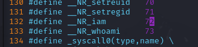

在系统调用函数表中增加系统调用条目：

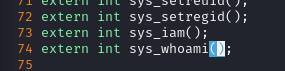

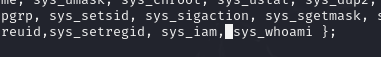

修改kernel文件夹中的Makefile，添加对应的依赖项：

在kernel目录中增加who.c这个文件，使用get_fs_byte和put_fs_byte将用户空间中的数据拷贝到内核空间中。因为代码运行在内核空间中，而name在用户空间，涉及到取用name的操作都需要通过get_fs_byte和put_fs_byte来进行：

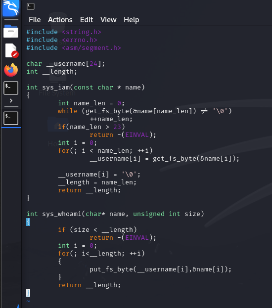

make all 编译

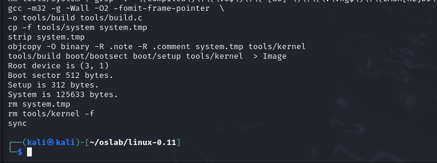

先执行挂载脚本

然后把测试脚本移入 hdc/usr/root 目录下

在 hdc/usr/root 目录下编写测试程序 iam.c 和 whoami.c

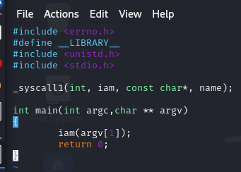

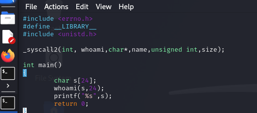

启动虚拟机后输入 ls ，可以看到已经添加了 iam.c 和 whoami.c 和测试脚本 testlab2.sh

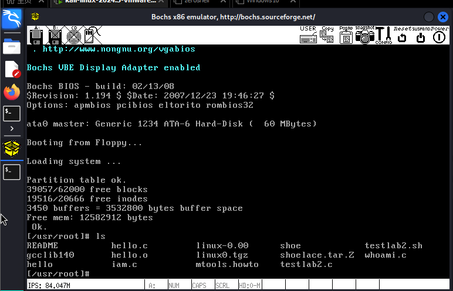

使用 gcc 编译 testlab2.c ，然后运行 testlab2

获得了 50% 的得分

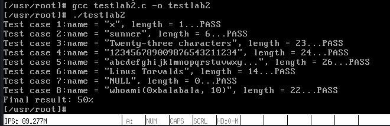

编译 iam.c 和 whoami.c ，然后运行 testlab2.sh

获得了 30% 的得分

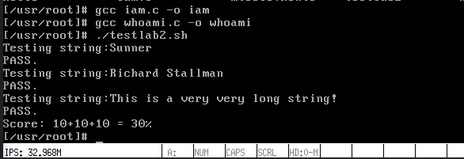

同时两个程序的输出结果也是正确的

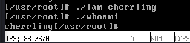

## 4.3. 实验报告

在实验报告中回答如下问题：

#### 从 Linux 0.11 现在的机制看，它的系统调用最多能传递几个参数？

在 unistd.h 中，有四个关于系统调用的方法：_syscall0、_syscall1、_syscall2、_syscall03。其中允许调用参数最多的是 _syscall3 ，它允许传递 3 个参数。系统调用号存放在 eax 寄存器，而各个参数则分别存放在 ebx、ecx 和 edx 寄存器中。所以 Linux 0.11 的系统调用最多能传递 3 个参数。

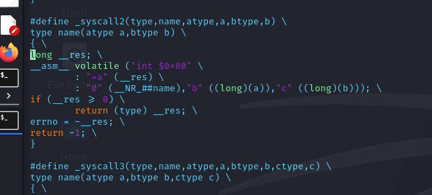

#### 你能想出办法来扩大这个限制吗？

可以通过将参数放在栈中，然后通过栈指针和寄存器间接访问参数的方法来扩大系统调用的参数个数。这样的话，系统调用的参数个数就不再受限于寄存器的个数，而是受限于栈的大小。

#### 用文字简要描述向 Linux 0.11 添加一个系统调用 foo() 的步骤。

1. 首先，需要在 include/unistd.h 中添加 foo() 的系统调用号。

2. 然后，在 kernel/system_call.s 中添加 foo() 的系统调用入口。修改 nr_system_calls的值，增加一个系统调用。

3. 接着，在 kernel/sys.h 中声明 foo() 的原型，即 extern int foo() 。

4. 在 kernel 中添加 foo.c 文件，实现 foo() 的功能。
   
5. 在 kernel/Makefile 中添加 foo.c 的编译规则。

6. 最后，重新编译 Linux 0.11 ，并启动内核，即可使用 foo() 系统调用。

### 4.3.1. 评分标准

将 testlab2.c 在修改过的 Linux 0.11 上编译运行，显示的结果即内核程序的得分。满分50%

只要至少一个新增的系统调用被成功调用，并且能和用户空间交换参数，可得满分

将脚本 testlab2.sh 在修改过的 Linux 0.11 上运行，显示的结果即应用程序的得分。满分30%

实验报告，20%
