# 5. 进程运行轨迹的跟踪与统计

## 5.1. 实验目的

掌握 Linux 下的多进程编程技术；

通过对进程运行轨迹的跟踪来形象化进程的概念；

在进程运行轨迹跟踪的基础上进行相应的数据统计，从而能对进程调度算法进行实际的量化评价， 更进一步加深对调度和调度算法的理解，获得能在实际操作系统上对调度算法进行实验数据对比的直接经验。

## 5.2. 实验内容

进程从创建（ Linux 下调用 fork() ）到结束的整个过程就是进程的生命期， 进程在其生命期中的运行轨迹实际上就表现为进程状态的多次切换，如进程创建以后会成为就绪态； 当该进程被调度以后会切换到运行态；在运行的过程中如果启动了一个文件读写操作， 操作系统会将该进程切换到阻塞态（等待态）从而让出 CPU ； 当文件读写完毕以后，操作系统会在将其切换成就绪态，等待进程调度算法来调度该进程执行……

本次实验包括如下内容：

基于模板 process.c 编写多进程的样本程序，实现如下功能：

所有子进程都并行运行，每个子进程的实际运行时间一般不超过 30 秒；

父进程向标准输出打印所有子进程的 id ，并在所有子进程都退出后才退出；

在 Linux 0.11 上实现进程运行轨迹的跟踪。基本任务是在内核中维护一个日志文件 /var/process.log ，把从操作系统启动到系统关机过程中所有进程的运行轨迹都记录在这一 log 文件中。

在修改过的 0.11 上运行样本程序，通过分析 log 文件，统计该程序建立的所有进程的等待时间、完成时间（周转时间）和运行时间，然后计算平均等待时间，平均完成时间和吞吐量。可以自己编写统计程序，也可以使用 python 脚本程序 stat_log.py 进行统计。

修改 0.11 进程调度的时间片，然后再运行同样的样本程序，统计同样的时间数据，和原有的情况对比，体会不同时间片带来的差异。

---

修改init/main.c文件
建立文件描述符0,1,2，使得能从内核加载时就写入 log 文件

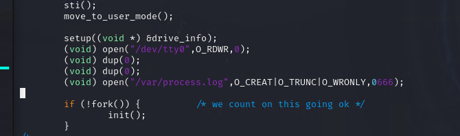

在kernel/printk.c增加打印函数

使用指导书提供的代码

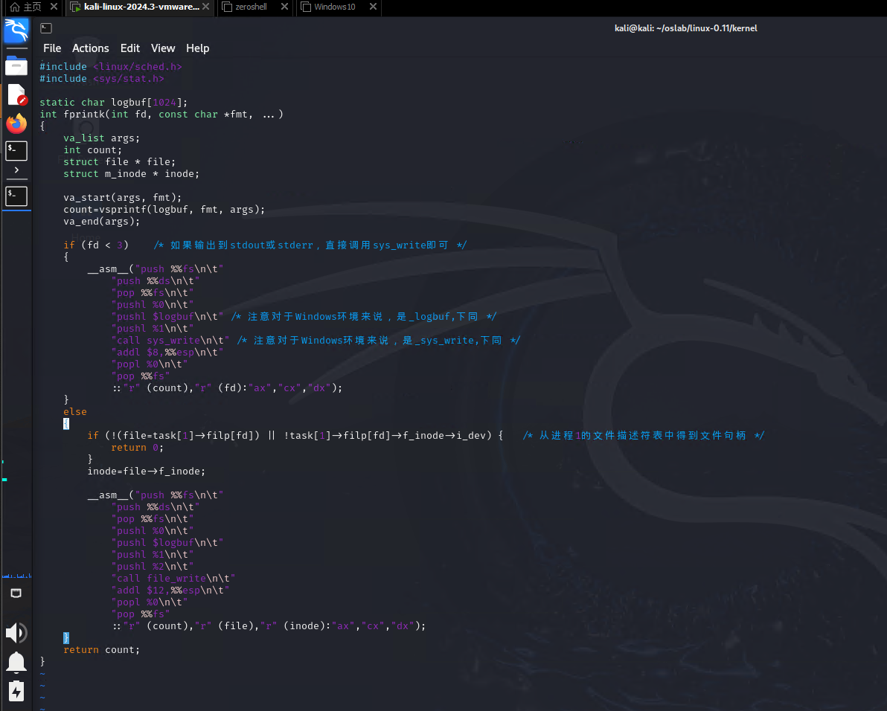

在各个进程切换关键点增加打印点来记录观察进程状态

1. 进程创建时

在kernel/fork.c中修改如下

2. 就绪态 - 运行态

在kernel/sched.c中修改，一个是在切换到就绪态时记录，一个是当前进程与要切换的进程不同时记录，

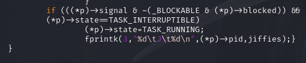

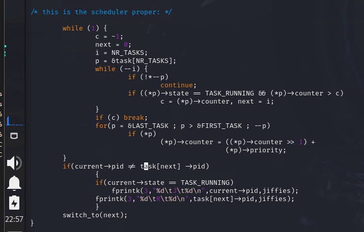

3. 运行态 - 睡眠

从运行态切换到不可中断睡眠态时记录

kernel/sched.c中sleep_on函数

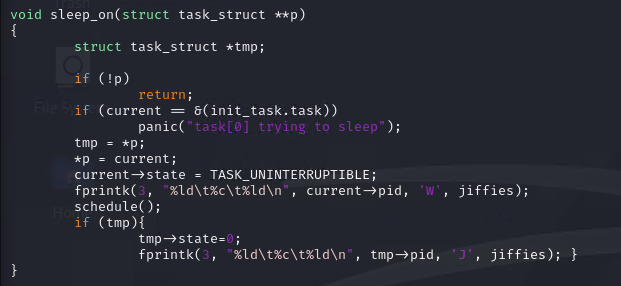

从运行态到可中断睡眠态时也需要记录

kernel/sched.c中interruptible_sleep_on函数

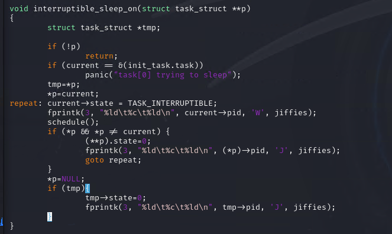

kernel/sched.c中sys_pause函数,进程主动睡眠的系统调用。

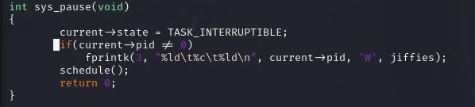

kernel/exit.c中sys_waitpid函数,进程等子进程结束的系统调用。

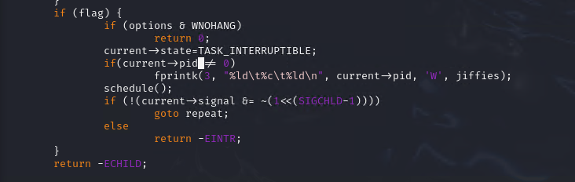

4. 睡眠态 - 就绪态

kernel/sched.c中wake_up函数

5. 运行态 - 僵死态

kernel/exit.c 中的 do_exit 函数

编写 process.c 文件

用 fork() 建立若干个同时运行的子进程，父进程等待所有子进程退出后才退出

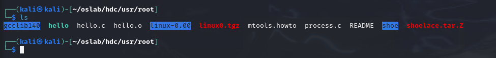

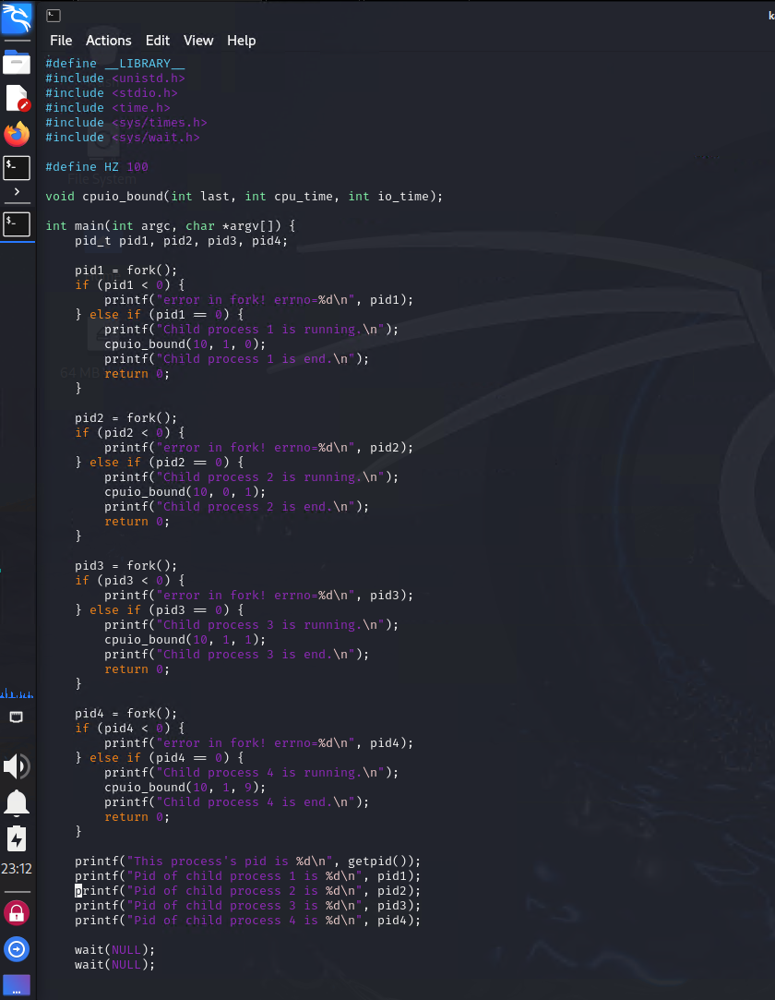

make并运行process程序

报 kernel panic

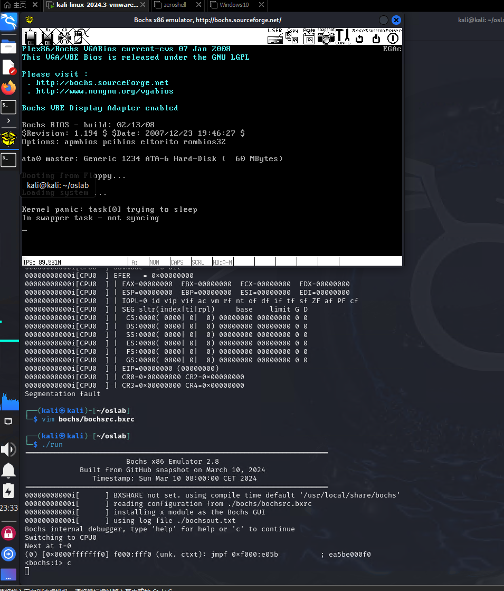

0号进程是系统的核心部分，让它进入睡眠状态可能会导致系统崩溃或无法正常工作。

根据资料修改fs/buffer.c文件

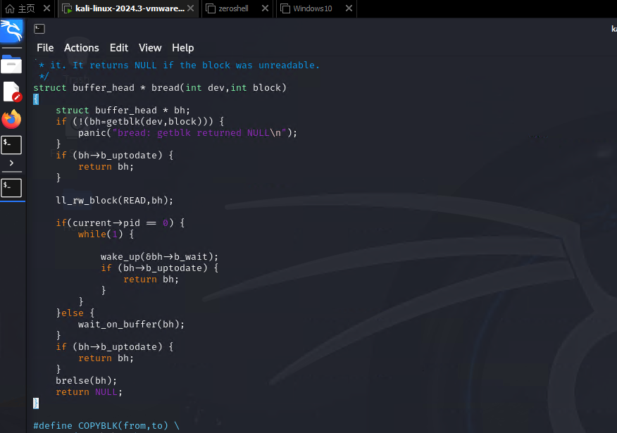

再次编译，成功运行

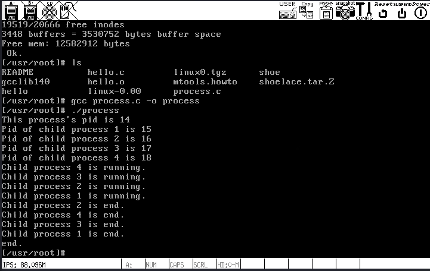

打印 process.log 部分内容如下

然后stat_log.py分析

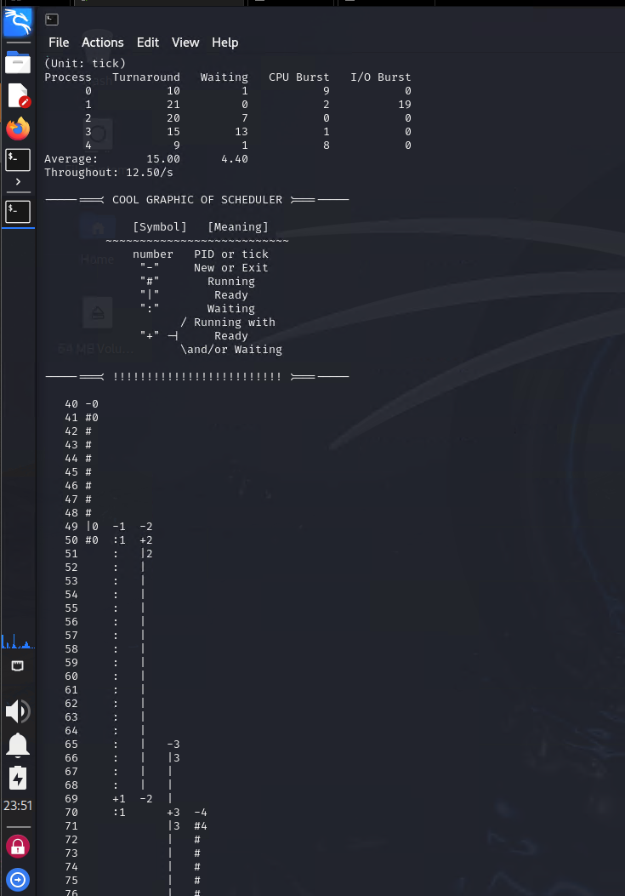

### 修改时间片

在include/linux/sched.h中发现如下内容

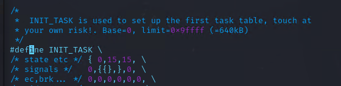

最后一个数值对应 priority

先改为 5 试试

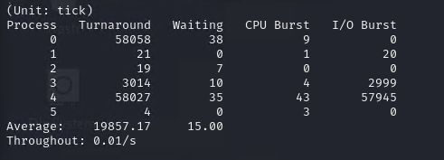

再改成 100 试试

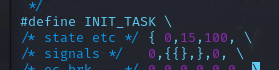

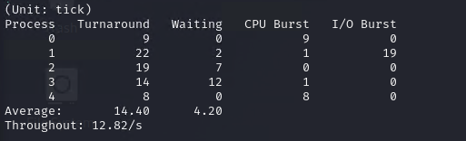

## 5.3. 实验报告

完成实验后，在实验报告中回答如下问题：

### 结合自己的体会，谈谈从程序设计者的角度看，单进程编程和多进程编程最大的区别是什么？

##### 单进程编程
1. **资源共享**：所有任务在同一进程中执行，资源（如内存、文件句柄）共享，管理简单。
2. **并发实现**：通常通过多线程或异步编程实现并发，线程之间共享内存。
3. **上下文切换**：上下文切换开销较小，因为只有一个进程。
4. **稳定性**：如果一个线程崩溃，可能导致整个进程崩溃，影响程序的稳定性。
5. **调试**：调试相对简单，所有代码在同一进程中，状态和变量可以直接访问。
6. **适用场景**：适合简单应用或对性能要求不高的场景。

##### 多进程编程
1. **资源隔离**：每个进程有独立的内存空间，资源管理复杂，进程间需要通过IPC机制进行通信。
2. **并发实现**：通过创建多个进程实现并发，进程之间相对独立。
3. **上下文切换**：上下文切换开销较大，但可以充分利用多核处理器。
4. **稳定性**：一个进程崩溃不会影响其他进程，提高了系统的稳定性和可靠性。
5. **调试**：调试较复杂，需要跟踪多个进程的状态，进程间通信可能导致难以重现的错误。
6. **适用场景**：适合高并发、高可用性和高稳定性的应用，如Web服务器、数据处理等。

通过以上对比，可以清晰地看到单进程和多进程在资源管理、并发实现、稳定性等方面的不同。

### 你是如何修改时间片的？仅针对样本程序建立的进程，在修改时间片前后， log 文件的统计结果（不包括Graphic）都是什么样？结合你的修改分析一下为什么会这样变化，或者为什么没变化？

修改 include/linux/sched.h 中的 INIT_TASK ，第三项为时间片

通过对比分析，我们发现，在周转时间方面，CPU 密集型任务在优先级较低（priority = 5）时占用更多的 CPU 资源，从而导致 I/O 密集型任务的周转时间延长。随着优先级的提高（priority = 100），I/O 密集型任务的响应时间显著缩短，进而使得系统整体的周转时间降低。

在等待时间方面，I/O 密集型任务的等待时间在较高优先级时显著减少，这主要是由于时间片较短，调度频率的增加使得这些任务能够更快地获得 CPU 资源。

### 5.3.1. 评分标准

process.c ，50%

日志文件建立成功，5%

能向日志文件输出信息，5%

5种状态都能输出，10%（每种2%）

调度算法修改，10%

实验报告，20%